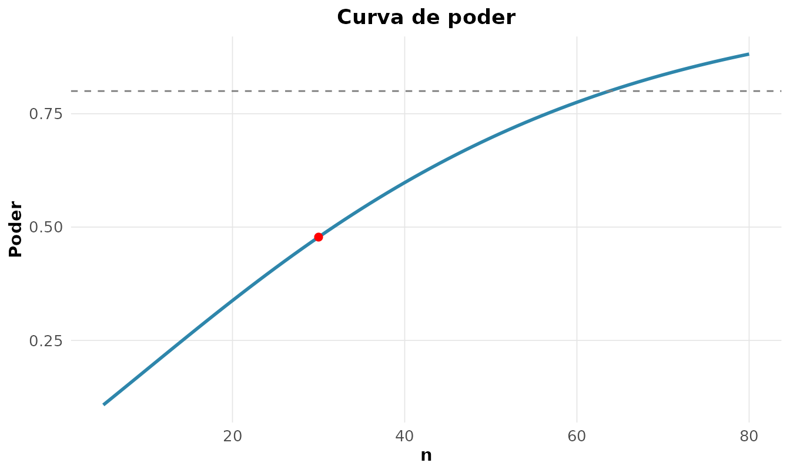

# 3. Inferencia Estatistica

## Dos dados a populacao

Inferencia e o salto do que observamos (a amostra) para o que queremos
saber (a populacao). E o curso mais importante de um bacharelado em
estatistica, e tambem o mais mal-interpretado. Usaremos
[`MASS::Pima.tr`](https://rdrr.io/pkg/MASS/man/Pima.tr.html): dados
reais de 200 mulheres da etnia Pima, com medidas clinicas e diagnostico
de diabetes.

``` r

dados <- MASS::Pima.tr
rnp_descritiva(dados$bmi)[c("n_validos", "media", "desvio", "se_media")]
#> # A tibble: 1 × 4
#>   n_validos media desvio se_media
#>       <dbl> <dbl>  <dbl>    <dbl>
#> 1       200  32.3   6.13    0.434
```

## Estimacao pontual: dois caminhos

Estimar um parametro pontualmente pode ser feito por **maxima
verossimilhanca** (EMV) — o valor que torna os dados observados mais
provaveis — ou pelo **metodo dos momentos**. Para o IMC, supondo Normal:

``` r

x <- dados$bmi
ll <- function(th) sum(dnorm(x, th[1], th[2], log = TRUE))
rnp_emv(ll, inicio = c(30, 5), nomes = c("media", "desvio"))$estimativas
#> # A tibble: 2 × 6
#>   parametro estimativa erro_padrao     z ic_inf ic_sup
#>   <chr>          <dbl>       <dbl> <dbl>  <dbl>  <dbl>
#> 1 media          32.3        0.432  74.7  31.5   33.2 
#> 2 desvio          6.11       0.306  20.0   5.52   6.71
```

A EMV nao da apenas o estimador: a curvatura da log-verossimilhanca no
maximo (a **informacao de Fisher**) fornece o erro-padrao. Quanto mais
“afilada” a verossimilhanca, mais informacao os dados trazem e menor a
incerteza:

``` r

rnp_log_verossimilhanca(function(mu) sum(dnorm(x, mu, sd(x), log = TRUE)),
                        intervalo = c(31, 35))
```


## Intervalo de confianca: o que ele *realmente* significa

``` r

rnp_ic_media(dados$bmi)
#> # A tibble: 1 × 7
#>   media erro_padrao limite_inferior limite_superior     n nivel_confianca
#>   <dbl>       <dbl>           <dbl>           <dbl> <dbl>           <dbl>
#> 1  32.3       0.434            31.5            33.2   200            0.95
#> # ℹ 1 more variable: distribuicao <chr>
```

Aqui mora a interpretacao mais distorcida da estatistica. Um IC de 95%
para a media **NAO** significa “ha 95% de probabilidade de a media
verdadeira estar neste intervalo”. A media verdadeira e uma constante
fixa — ou esta, ou nao esta.

A interpretacao **frequentista correta**: se repetissemos o estudo
muitas vezes e construissemos um IC a cada vez, **95% desses
intervalos** conteriam a media verdadeira. A confianca esta no
*procedimento*, nao neste intervalo particular.

## Teste de hipoteses e o p-valor

Sera que o IMC medio dessa populacao difere de 30 (limiar de obesidade)?

``` r

rnp_teste_t(dados$bmi, mu = 30)
#> # A tibble: 1 × 10
#>   estatistica    gl p_valor media_x media_y  diff ic_inf ic_sup hipotese_nula
#>         <dbl> <dbl>   <dbl>   <dbl>   <dbl> <dbl>  <dbl>  <dbl>         <dbl>
#> 1        5.33   199       0    32.3      NA  2.31   31.5   33.2            30
#> # ℹ 1 more variable: alternativa <chr>
```

Agora o conceito mais escorregadio de todos. O **p-valor** e:

> a probabilidade de observar uma estatistica tao ou mais extrema que a
> obtida, **supondo H0 verdadeira**.

O que o p-valor **NAO** e:

- *Nao* e a probabilidade de H0 ser verdadeira.
- *Nao* e a probabilidade de o resultado ter sido “sorte”.
- Um p \< 0,05 *nao* mede o tamanho nem a importancia do efeito — apenas
  a evidencia contra H0.

E os dois tipos de erro que rondam toda decisao:

- **Erro tipo I** ($`\alpha`$): rejeitar H0 sendo ela verdadeira (falso
  positivo).
- **Erro tipo II** ($`\beta`$): nao rejeitar H0 sendo ela falsa (falso
  negativo).

## Poder: a face esquecida do teste

O **poder** ($`1-\beta`$) e a probabilidade de detectar um efeito que
existe de fato. Estudos com pouco poder produzem tanto falsos negativos
quanto achados “significativos” que nao se replicam. Quantos sujeitos
precisamos para detectar um efeito medio (d de Cohen = 0,5) com 80% de
poder?

``` r

rnp_tamanho_amostra_teste(efeito = 0.5, poder = 0.8, tipo = "duas")
#> # A tibble: 1 × 5
#>   efeito poder_alvo alpha     n poder_obtido
#>    <dbl>      <dbl> <dbl> <int>        <dbl>
#> 1    0.5        0.8  0.05    64        0.802
```

A curva de poder mostra o trade-off entre tamanho amostral e capacidade
de deteccao:

``` r

rnp_poder_teste(efeito = 0.5, n = 30, tipo = "duas")$grafico
```



**Planejar o poder ANTES de coletar dados** e o que separa pesquisa
seria de pescaria de p-valores.

## Quando nao ha formula: o bootstrap

Para a media, o erro-padrao tem formula fechada ($`s/\sqrt{n}`$). Mas e
para a **mediana**, ou para um quantil? O **bootstrap** de Efron resolve
por reamostragem: reamostra-se a propria amostra com reposicao milhares
de vezes e observa-se a variabilidade da estatistica.

``` r

rnp_ic_bootstrap(dados$bmi, estatistica = "mediana", B = 1000, tipo = "percentil")
#> # A tibble: 1 × 5
#>   estimativa limite_inferior limite_superior metodo     conf
#>        <dbl>           <dbl>           <dbl> <chr>     <dbl>
#> 1       32.8            31.6            33.8 percentil  0.95
```

Nenhuma suposicao de normalidade foi feita — o bootstrap deixa os dados
falarem. E o canivete da inferencia moderna para estatisticas sem teoria
assintotica amigavel.

## Comparando grupos sem assumir normalidade: permutacao

Diabeticas e nao-diabeticas diferem na glicose? Em vez de confiar no
TCL, o **teste de permutacao** constroi a distribuicao nula embaralhando
os rotulos — inferencia exata, baseada apenas na troca de etiquetas sob
H0:

``` r

g1 <- dados$glu[dados$type == "Yes"]
g0 <- dados$glu[dados$type == "No"]
rnp_teste_permutacao(g1, g0, B = 2000)
#> # A tibble: 1 × 4
#>   diff_observada p_valor     B alternativa
#>            <dbl>   <dbl> <dbl> <chr>      
#> 1           32.0       0  2000 bilateral
```

## Sintese: o “kit” da inferencia madura

| Conceito | O que e | Erro comum |
|----|----|----|
| Verossimilhanca | plausibilidade dos dados sob $`\theta`$ | confundir com probabilidade de $`\theta`$ |
| IC de 95% | 95% dos intervalos cobririam o parametro | “95% de chance de estar aqui” |
| p-valor | P(dados \| H0) | “P(H0 \| dados)” |
| Poder | P(detectar efeito real) | ignora-lo no planejamento |
| Bootstrap | EP por reamostragem | so usar quando ha formula |

Dominar *o que cada numero significa* — nao apenas como calcula-lo — e o
que distingue o estatistico do operador de software.
