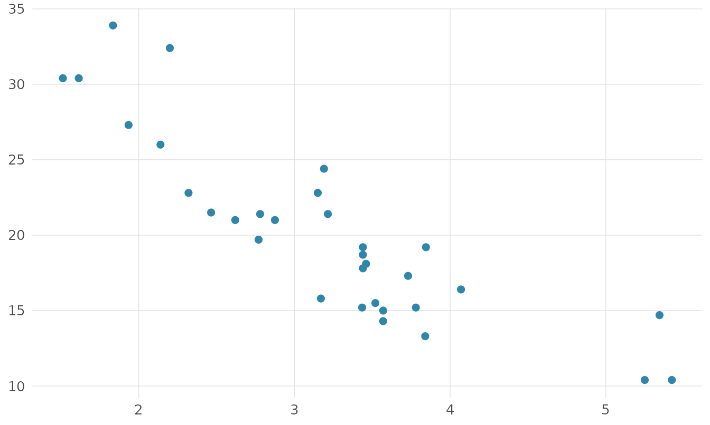

# Introducao ao rnp

## O que e o `rnp`

O `rnp` (do projeto **R NA PRATICA**) e um pacote didatico e de producao
que reune mais de **180 funcoes** cobrindo as ementas dos tres primeiros
anos de um bacharelado em Estatistica: descritiva, probabilidade,
inferencia, regressao, multivariada, series temporais, dados categoricos
e pre-processamento.

Tres compromissos guiam o projeto:

- **Didatico e correto** — documentacao e mensagens em portugues, saidas
  em `tibble`, graficos em `ggplot2`.
- **Rapido** — lacos pesados e algebra matricial rodam em **C++**
  (Rcpp/RcppArmadillo), com 12 nucleos verificados contra a referencia
  do R.
- **Enxuto** — depende apenas de R base, tidyverse, tidymodels e Rcpp.

## Instalacao

``` r

# install.packages("devtools")
devtools::install_github("evandeilton/rnp")
```

## Um tour de cinco minutos

Toda funcao analitica retorna um `tibble`, pronto para o pipe.

### Descritiva

``` r

library(rnp)
rnp_descritiva(airquality$Temp)
#> # A tibble: 1 × 21
#>       n n_validos n_faltantes  soma media mediana  moda desvio variancia   min
#>   <dbl>     <dbl>       <dbl> <dbl> <dbl>   <dbl> <dbl>  <dbl>     <dbl> <dbl>
#> 1   153       153           0 11916  77.9      79    81   9.47      89.6    56
#> # ℹ 11 more variables: q1 <dbl>, q3 <dbl>, max <dbl>, amplitude <dbl>,
#> #   iqr <dbl>, cv <dbl>, se_media <dbl>, ic_inf <dbl>, ic_sup <dbl>,
#> #   assimetria <dbl>, curtose <dbl>
```

### Inferencia

``` r

rnp_ic_media(airquality$Temp)
#> # A tibble: 1 × 7
#>   media erro_padrao limite_inferior limite_superior     n nivel_confianca
#>   <dbl>       <dbl>           <dbl>           <dbl> <dbl>           <dbl>
#> 1  77.9       0.765            76.4            79.4   153            0.95
#> # ℹ 1 more variable: distribuicao <chr>
rnp_teste_t(airquality$Temp, mu = 75)
#> # A tibble: 1 × 10
#>   estatistica    gl p_valor media_x media_y  diff ic_inf ic_sup hipotese_nula
#>         <dbl> <dbl>   <dbl>   <dbl>   <dbl> <dbl>  <dbl>  <dbl>         <dbl>
#> 1        3.77   152  0.0002    77.9      NA  2.88   76.4   79.4            75
#> # ℹ 1 more variable: alternativa <chr>
```

### Regressao

``` r

fit <- rnp_regressao(mpg ~ wt + hp, data = mtcars)
fit$coeficientes
#> # A tibble: 3 × 7
#>   termo       estimativa erro_padrao estatistica_t p_valor  ic_inf  ic_sup
#>   <chr>            <dbl>       <dbl>         <dbl>   <dbl>   <dbl>   <dbl>
#> 1 (Intercept)    37.2          1.60          23.3   0      34.0    40.5   
#> 2 wt             -3.88         0.633         -6.13  0      -5.17   -2.58  
#> 3 hp             -0.0318       0.009         -3.52  0.0015 -0.0502 -0.0133
```

### Visualizacao

``` r

rnp_grafico_dispersao(mtcars, x = "wt", y = "mpg")
```



## Por onde continuar

O pacote acompanha seis tutoriais que percorrem a progressao 1o -\> 3o
ano, com dados reais e enfase conceitual (interpretacao e armadilhas,
nao apenas codigo):

1.  **Estatistica Descritiva e Analise Exploratoria**
2.  **Probabilidade, Distribuicoes e os Teoremas Fundamentais** (Bayes,
    LGN, TCL)
3.  **Inferencia Estatistica** (p-valor, IC, bootstrap, poder)
4.  **Regressao Linear e Modelagem** (projecao, pressupostos,
    regularizacao)
5.  **Analise Multivariada** (PCA, cluster, LDA, Hotelling)
6.  **Dados Categoricos e Metodos Nao-Parametricos**

``` r

browseVignettes("rnp")
```

## Reportar problemas

Bugs e sugestoes de novas funcoes sao bem-vindos nas
[issues](https://github.com/evandeilton/rnp/issues) do projeto.
