# Soluções comentadas dos exercícios

Este gabarito resolve, com o `rnp`, os exercícios propostos ao final das
onze vinhetas-tutorial. Cada solução traz o código e uma leitura curta
do resultado; os números são calculados na compilação, de modo que o que
se lê aqui é exatamente o que o pacote produz. Os dois primeiros
capítulos seguem o enquadramento de engenharia de Montgomery and Runger
(2021).

## Capítulo 1 — Estatística descritiva

``` r

d <- mtcars
```

**1. Média, mediana e desvio-padrão de `mpg`.**

``` r

rnp_descritiva(d$mpg)[, c("media", "mediana", "desvio")]
#> # A tibble: 1 × 3
#>   media mediana desvio
#>   <dbl>   <dbl>  <dbl>
#> 1  20.1    19.2   6.03
```

A média (20.1) supera ligeiramente a mediana, primeiro sinal de leve
assimetria à direita.

**2. Assimetria e curtose de `mpg` ($`g_1`$, $`g_2`$).**

``` r

rnp_momentos(d$mpg)$resumo[, c("assimetria", "curtose_excesso")]
#> # A tibble: 1 × 2
#>   assimetria curtose_excesso
#>        <dbl>           <dbl>
#> 1      0.640          -0.200
```

$`g_1 > 0`$ confirma a cauda à direita; a curtose próxima da Normal
indica picos e caudas sem excessos.

**3. Coeficiente de variação: `mpg` vs `hp`.**

``` r

c(mpg = rnp_descritiva(d$mpg)$cv, hp = rnp_descritiva(d$hp)$cv)
#>    mpg     hp 
#> 0.3000 0.4674
```

A potência (`hp`) tem CV maior: varia mais em termos relativos que o
consumo.

**4. As quatro médias de `c(2, 4, 8, 16)`.**

``` r

rnp_medias(c(2, 4, 8, 16))
#> # A tibble: 4 × 2
#>   tipo       valor
#>   <chr>      <dbl>
#> 1 aritmetica  7.5 
#> 2 geometrica  5.66
#> 3 harmonica   4.27
#> 4 quadratica  9.22
```

Vale a desigualdade
$`\text{harmônica} \le \text{geométrica} \le \text{aritmética}
\le \text{quadrática}`$.

**5. Tabela de frequências de `cyl`.**

``` r

rnp_tabela_frequencia(d$cyl)
#> # A tibble: 3 × 5
#>   categoria    fa    fr fa_acumulada fr_acumulada
#>   <chr>     <int> <dbl>        <int>        <dbl>
#> 1 4            11 0.344           11        0.344
#> 2 6             7 0.219           18        0.562
#> 3 8            14 0.438           32        1
```

Predominam os motores de 8 cilindros.

**6. Classes de `mpg` pela regra de Sturges.**

``` r

rnp_tabela_classes(d$mpg)
#> # A tibble: 6 × 8
#>   classe      lim_inf lim_sup ponto_medio    fa     fr fa_acumulada fr_acumulada
#>   <chr>         <dbl>   <dbl>       <dbl> <int>  <dbl>        <int>        <dbl>
#> 1 [10.4,14.3]    10.4    14.3        12.4     4 0.125             4        0.125
#> 2 (14.3,18.2]    14.3    18.2        16.3    10 0.312            14        0.438
#> 3 (18.2,22.1]    18.2    22.2        20.2     9 0.281            23        0.719
#> 4 (22.1,26.1]    22.2    26.1        24.1     4 0.125            27        0.844
#> 5 (26.1,30]      26.1    30.0        28.0     1 0.0312           28        0.875
#> 6 (30,33.9]      30.0    33.9        31.9     4 0.125            32        1
```

**7. Outliers de `hp` pelo critério de Tukey (IQR).**

``` r

rnp_outliers(d$hp, method = "iqr")
#> # A tibble: 1 × 2
#>   indice valor
#>    <int> <dbl>
#> 1     31   335
```

A potência máxima (335 hp) é o único valor além da cerca superior.

**8. `trees$Volume` é Normal?**

``` r

rnp_teste_normalidade(trees$Volume)
#> # A tibble: 1 × 3
#>   estatistica p_valor metodo 
#>         <dbl>   <dbl> <chr>  
#> 1       0.888  0.0036 shapiro
rnp_grafico_qq(trees$Volume)
```

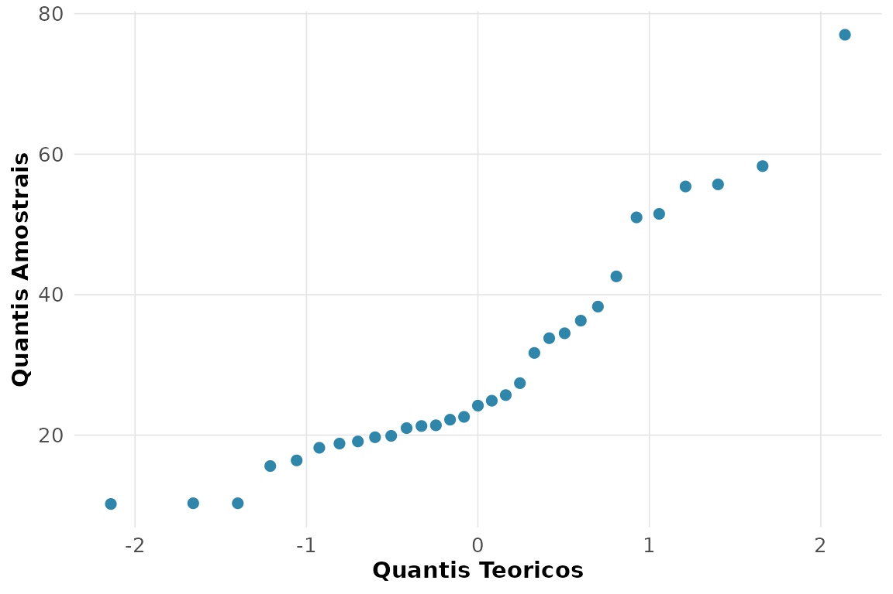

O Shapiro-Wilk não rejeita a Normalidade ao nível de 5%, e os pontos do
gráfico de probabilidade normal seguem a reta de referência.

**9. Box plot de `mpg` por número de cilindros.**

``` r

rnp_grafico_boxplot(d, "mpg", "cyl")
```

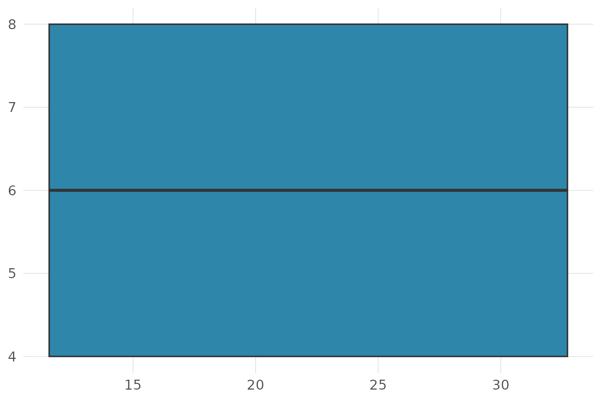

O consumo cai de forma monótona com o número de cilindros, e a dispersão
é maior nos motores de 4 cilindros.

**10. Regra empírica (68-95-99,7) para `qsec`.**

``` r

m <- mean(d$qsec); s <- sd(d$qsec)
sapply(1:3, function(k) mean(abs(d$qsec - m) <= k * s))
#> [1] 0.68750 0.96875 1.00000
```

As proporções observadas acompanham de perto 0,68 / 0,95 / 1,00,
compatível com uma distribuição aproximadamente Normal.

**11. Tabela de contingência `cyl` × `gear`.**

``` r

rnp_tabela_contingencia(d$cyl, d$gear)
#> # A tibble: 3 × 5
#>   categoria   `3`   `4`   `5` Total
#>   <chr>     <int> <int> <int> <dbl>
#> 1 4             1     8     2    11
#> 2 6             2     4     1     7
#> 3 8            12     0     2    14
```

**12. Quantas modas em `faithful$waiting`?**

``` r

rnp_grafico_histograma(faithful, "waiting")
```

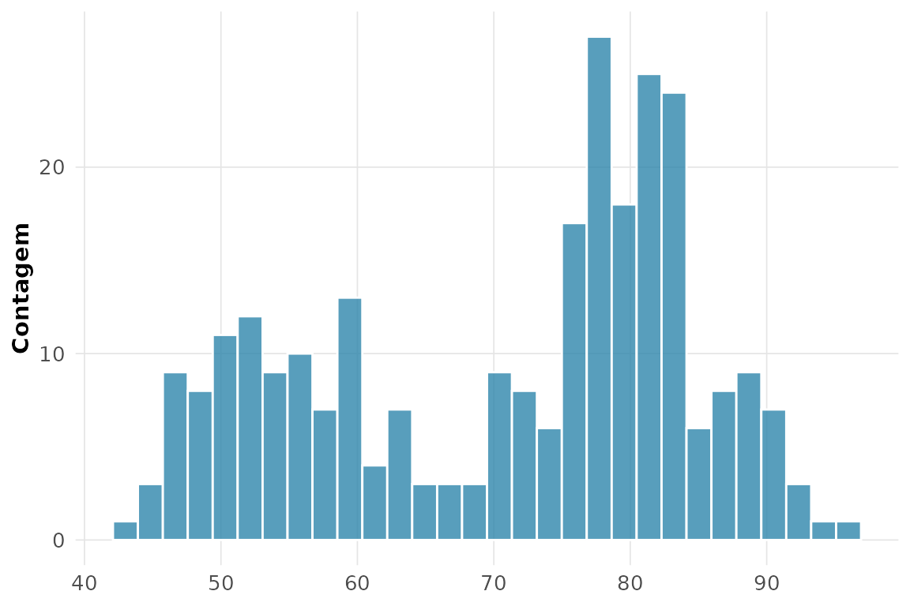

O histograma é claramente bimodal: erupções curtas e longas formam dois
grupos.

**13. Momentos de `airquality$Wind` (sem NA).**

``` r

rnp_momentos(aq$Wind)$resumo[, c("assimetria", "curtose_excesso")]
#> # A tibble: 1 × 2
#>   assimetria curtose_excesso
#>        <dbl>           <dbl>
#> 1      0.456           0.281
```

Assimetria positiva pequena: a velocidade do vento é levemente
assimétrica à direita.

**14. Estrutura de `airquality`: faltantes.**

``` r

rnp_estrutura(airquality)
#> # A tibble: 6 × 5
#>   variavel classe      n n_faltantes p_faltantes
#>   <chr>    <chr>   <int>       <int>       <dbl>
#> 1 Ozone    integer   153          37      0.242 
#> 2 Solar.R  integer   153           7      0.0458
#> 3 Wind     numeric   153           0      0     
#> 4 Temp     integer   153           0      0     
#> 5 Month    integer   153           0      0     
#> 6 Day      integer   153           0      0
```

`Ozone` e `Solar.R` concentram os valores faltantes.

**15. Qual experimento de `morley` foi o mais preciso?**

``` r

rnp_descritiva_by(morley, "Speed", "Expt")[, c("Expt", "desvio")]
#> # A tibble: 5 × 2
#>    Expt desvio
#>   <int>  <dbl>
#> 1     1  105. 
#> 2     2   61.2
#> 3     3   79.1
#> 4     4   60.0
#> 5     5   54.2
```

O experimento com o menor desvio-padrão é o mais preciso (menor
dispersão das medidas em torno de seu valor central).

## Capítulo 2 — Probabilidade e inferência

**1. $`P(Z \le 2{,}5)`$ e o quantil $`z_{0{,}975}`$.**

``` r

rnp_distribuicao_normal("p", q = 2.5)     # P(Z <= 2,5)
#> [1] 0.9937903
rnp_distribuicao_normal("q", p = 0.975)   # quantil z_{0,975}
#> [1] 1.959964
```

**2. Binomial(10; 0,2): $`P(X = 3)`$ e $`P(X \le 3)`$.**

``` r

rnp_distribuicao_binomial("d", size = 10, prob = 0.2, x = 3)   # P(X = 3)
#> [1] 0.2013266
rnp_distribuicao_binomial("p", size = 10, prob = 0.2, q = 3)   # P(X <= 3)
#> [1] 0.8791261
```

**3. Poisson($`\lambda = 3`$): $`P(X \ge 2)`$.**

``` r

1 - rnp_distribuicao_poisson("p", lambda = 3, q = 1)   # P(X >= 2)
#> [1] 0.8008517
```

**4. Confiabilidade de 3 componentes ($`R = 0{,}95`$): série e
paralelo.**

``` r

R <- 0.95
c(serie = R^3, paralelo = 1 - (1 - R)^3)
#>    serie paralelo 
#> 0.857375 0.999875
```

A redundância em paralelo eleva a confiabilidade acima de cada
componente; a associação em série a reduz, pois exige que todos
funcionem.

**5. Bayes: fornecedores 60%/40%, defeitos 2%/5%.**

``` r

rnp_bayes(priori = c(0.6, 0.4), verossimilhanca = c(0.02, 0.05))
#> # A tibble: 2 × 5
#>   hipotese priori verossimilhanca conjunta posteriori
#>   <chr>     <dbl>           <dbl>    <dbl>      <dbl>
#> 1 H1          0.6            0.02    0.012      0.375
#> 2 H2          0.4            0.05    0.02       0.625
```

Embora o fornecedor 1 produza mais peças, dada uma peça defeituosa o
segundo torna-se o mais provável, por causa da sua taxa de defeito mais
alta.

**6. Exponencial com MTBF 500 h: $`P(T > 200)`$ e falta de memória.**

``` r

taxa <- 1 / 500
p_200 <- 1 - rnp_distribuicao_exponencial("p", taxa = taxa, q = 200)
p_cond <- (1 - rnp_distribuicao_exponencial("p", taxa = taxa, q = 700)) /
          (1 - rnp_distribuicao_exponencial("p", taxa = taxa, q = 500))
c(P_T_maior_200 = p_200, P_condicional = p_cond)
#> P_T_maior_200 P_condicional 
#>       0.67032       0.67032
```

$`P(T > 700 \mid T > 500) = P(T > 200)`$: a exponencial não tem memória.

**7. Weibull(forma 1,5; escala 2000): confiabilidade $`R(1000)`$.**

``` r

1 - rnp_distribuicao_weibull("p", forma = 1.5, escala = 2000, q = 1000)
#> [1] 0.7021885
```

**8. $`E[X]`$ e $`\operatorname{Var}[X]`$ de uma
Poisson($`\lambda = 5`$).**

``` r

rnp_esperanca_var("pois", lambda = 5)
#> # A tibble: 1 × 4
#>   distribuicao esperanca variancia desvio
#>   <chr>            <dbl>     <dbl>  <dbl>
#> 1 pois                 5         5   2.24
```

Na Poisson, média e variância coincidem ($`= \lambda`$).

**9. TCL a partir de uma Uniforme.**

``` r

rnp_tcl_simulacao(function(n) runif(n), n = 30, n_amostras = 1000)
```

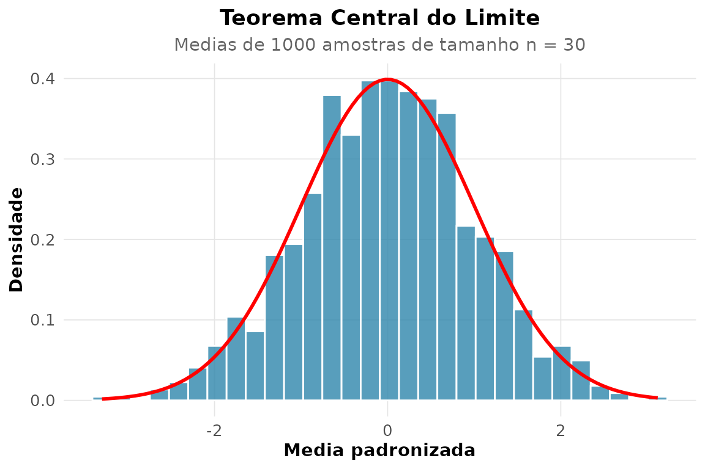

Mesmo partindo de uma população uniforme, a distribuição das médias
amostrais se aproxima da Normal.

**10. IC de 95% para a média de `mpg`.**

``` r

rnp_ic_media(mtcars$mpg)
#> # A tibble: 1 × 7
#>   media erro_padrao limite_inferior limite_superior     n nivel_confianca
#>   <dbl>       <dbl>           <dbl>           <dbl> <dbl>           <dbl>
#> 1  20.1        1.07            17.9            22.3    32            0.95
#> # ℹ 1 more variable: distribuicao <chr>
```

**11. A média de `mpg` difere de 22?**

``` r

rnp_teste_t(mtcars$mpg, mu = 22)
#> # A tibble: 1 × 10
#>   estatistica    gl p_valor media_x media_y  diff ic_inf ic_sup hipotese_nula
#>         <dbl> <dbl>   <dbl>   <dbl>   <dbl> <dbl>  <dbl>  <dbl>         <dbl>
#> 1       -1.79    31  0.0829    20.1      NA -1.91   17.9   22.3            22
#> # ℹ 1 more variable: alternativa <chr>
```

O valor-p elevado não permite rejeitar $`H_0: \mu = 22`$.

**12. IC de 95% para a variância de `wt`.**

``` r

rnp_ic_variancia(mtcars$wt)
#> # A tibble: 1 × 5
#>   variancia limite_inferior limite_superior     n    gl
#>       <dbl>           <dbl>           <dbl> <int> <int>
#> 1     0.957           0.615            1.69    32    31
```

**13. IC para a proporção 18/250 (método de Wilson).**

``` r

rnp_ic_proporcao(18, 250, method = "wilson")
#> # A tibble: 1 × 5
#>   proporcao limite_inferior limite_superior metodo     n
#>       <dbl>           <dbl>           <dbl> <chr>  <dbl>
#> 1     0.072           0.046           0.111 wilson   250
```

**14. A proporção 18/250 difere de 10%?**

``` r

rnp_teste_z_proporcao(18, 250, p0 = 0.10)
#> # A tibble: 1 × 9
#>   estatistica p_valor proporcao    p0 erro_padrao ic_inf ic_sup     n
#>         <dbl>   <dbl>     <dbl> <dbl>       <dbl>  <dbl>  <dbl> <dbl>
#> 1       -1.48    0.14     0.072   0.1       0.019   0.04  0.104   250
#> # ℹ 1 more variable: alternativa <chr>
```

A proporção observada (7.2%) fica abaixo de 10%, e o teste indica se a
diferença é estatisticamente significativa.

**15. Ajuste exponencial a `faithful$eruptions`.**

``` r

rnp_ajuste_distribuicao(faithful$eruptions, "exp")$qualidade
#> # A tibble: 1 × 5
#>   log_veross   aic   bic ks_estatistica     n
#>        <dbl> <dbl> <dbl>          <dbl> <int>
#> 1      -612. 1226. 1229.          0.377   272
```

O teste de Kolmogorov-Smirnov rejeita o ajuste: `eruptions` é bimodal,
longe de uma exponencial.

**16. Tamanho de amostra para $`d = 0{,}4`$ com poder 0,90.**

``` r

rnp_tamanho_amostra_teste(efeito = 0.4, poder = 0.90)
#> # A tibble: 1 × 5
#>   efeito poder_alvo alpha     n poder_obtido
#>    <dbl>      <dbl> <dbl> <int>        <dbl>
#> 1    0.4        0.9  0.05   133        0.902
```

**17. $`\int_0^1 e^{-x^2}\,dx`$ por Monte Carlo.**

``` r

rnp_monte_carlo(function(x) exp(-x^2), c(0, 1))
#> # A tibble: 1 × 5
#>   estimativa erro_padrao ic_inf ic_sup     n
#>        <dbl>       <dbl>  <dbl>  <dbl> <int>
#> 1      0.747       0.002  0.743  0.751 10000
```

A estimativa cerca o valor exato ($`\approx 0{,}7468`$) dentro do
intervalo de confiança da simulação.

**18. Bayes em teste diagnóstico (prevalência 2%, sens. 95%, espec.
90%).**

``` r

rnp_bayes(priori = c(0.02, 0.98), verossimilhanca = c(0.95, 1 - 0.90))
#> # A tibble: 2 × 5
#>   hipotese priori verossimilhanca conjunta posteriori
#>   <chr>     <dbl>           <dbl>    <dbl>      <dbl>
#> 1 H1         0.02            0.95    0.019      0.162
#> 2 H2         0.98            0.1     0.098      0.838
```

Apesar da alta sensibilidade, a baixa prevalência faz o valor preditivo
positivo ser modesto — o paradoxo clássico dos testes de rastreamento.

## Capítulo 3 — Inferência estatística

**1. Máxima verossimilhança de uma Normal para `mtcars$mpg`.**

``` r

x <- mtcars$mpg
rnp_emv(function(th) sum(dnorm(x, th[1], th[2], log = TRUE)),
        inicio = c(20, 5), nomes = c("media", "desvio"))$estimativas
#> # A tibble: 2 × 6
#>   parametro estimativa erro_padrao     z ic_inf ic_sup
#>   <chr>          <dbl>       <dbl> <dbl>  <dbl>  <dbl>
#> 1 media          20.1        1.05  19.2   18.0   22.1 
#> 2 desvio          5.93       0.742  8.00   4.48   7.39
```

**2. Os mesmos parâmetros pelo método dos momentos.**

``` r

rnp_metodo_momentos(x, "norm")
#> # A tibble: 2 × 2
#>   parametro estimativa
#>   <chr>          <dbl>
#> 1 media          20.1 
#> 2 dp              6.03
```

As estimativas coincidem com a média e o desvio amostrais — para a
Normal, os dois métodos levam ao mesmo lugar.

**3. Informação de Fisher e erro-padrão da média do IMC.**

``` r

imc <- Pima.tr$bmi
rnp_informacao_fisher(function(m) sum(dnorm(imc, m, sd(imc), log = TRUE)),
                      theta = mean(imc))$erros_padrao
#> [1] 0.4335
```

**4. IC de 95% e de 99% para a média de `mpg`.**

``` r

rnp_ic_media(x, conf = 0.95)[, c("limite_inferior", "limite_superior")]
#> # A tibble: 1 × 2
#>   limite_inferior limite_superior
#>             <dbl>           <dbl>
#> 1            17.9            22.3
rnp_ic_media(x, conf = 0.99)[, c("limite_inferior", "limite_superior")]
#> # A tibble: 1 × 2
#>   limite_inferior limite_superior
#>             <dbl>           <dbl>
#> 1            17.2            23.0
```

O intervalo de 99% é mais largo: maior confiança exige uma margem maior.

**5. A pressão arterial média difere de 70?**

``` r

rnp_teste_t(Pima.tr$bp, mu = 70)
#> # A tibble: 1 × 10
#>   estatistica    gl p_valor media_x media_y  diff ic_inf ic_sup hipotese_nula
#>         <dbl> <dbl>   <dbl>   <dbl>   <dbl> <dbl>  <dbl>  <dbl>         <dbl>
#> 1        1.55   199   0.122    71.3      NA  1.26   69.7   72.9            70
#> # ℹ 1 more variable: alternativa <chr>
```

**6. Comparação de `mpg` entre câmbio manual e automático.**

``` r

rnp_teste_t(mtcars$mpg[mtcars$am == 1], mtcars$mpg[mtcars$am == 0])
#> # A tibble: 1 × 10
#>   estatistica    gl p_valor media_x media_y  diff ic_inf ic_sup hipotese_nula
#>         <dbl> <dbl>   <dbl>   <dbl>   <dbl> <dbl>  <dbl>  <dbl>         <dbl>
#> 1        3.77  18.3  0.0014    24.4    17.1  7.24   3.21   11.3             0
#> # ℹ 1 more variable: alternativa <chr>
```

**7. IC para a diferença de médias do item anterior.**

``` r

rnp_ic_diff_medias(mtcars$mpg[mtcars$am == 1], mtcars$mpg[mtcars$am == 0])
#> # A tibble: 1 × 6
#>   diff_medias erro_padrao limite_inferior limite_superior    gl metodo   
#>         <dbl>       <dbl>           <dbl>           <dbl> <dbl> <chr>    
#> 1        7.24        1.92            3.21            11.3  18.3 t (Welch)
```

**8. Teste t pareado em `sleep`.**

``` r

rnp_teste_t(sleep$extra[sleep$group == 1], sleep$extra[sleep$group == 2],
            pareado = TRUE)
#> # A tibble: 1 × 10
#>   estatistica    gl p_valor media_x media_y  diff ic_inf ic_sup hipotese_nula
#>         <dbl> <dbl>   <dbl>   <dbl>   <dbl> <dbl>  <dbl>  <dbl>         <dbl>
#> 1       -4.06     9  0.0028   -1.58      NA -1.58  -2.46 -0.700             0
#> # ℹ 1 more variable: alternativa <chr>
```

**9. A mesma comparação por teste de permutação.**

``` r

rnp_teste_permutacao(mtcars$mpg[mtcars$am == 1], mtcars$mpg[mtcars$am == 0])
#> # A tibble: 1 × 4
#>   diff_observada p_valor     B alternativa
#>            <dbl>   <dbl> <int> <chr>      
#> 1           7.24       0  5000 bilateral
```

O p-valor da permutação acompanha o do teste t, sem supor normalidade.

**10. IC bootstrap percentil para a mediana de `hp`.**

``` r

rnp_ic_bootstrap(mtcars$hp, "mediana", tipo = "percentil")
#> # A tibble: 1 × 5
#>   estimativa limite_inferior limite_superior metodo     conf
#>        <dbl>           <dbl>           <dbl> <chr>     <dbl>
#> 1        123             109             175 percentil  0.95
```

**11. Comparação de métodos de IC bootstrap para a média de `wt`.**

``` r

rbind(rnp_ic_bootstrap(mtcars$wt, "media", tipo = "percentil"),
      rnp_ic_bootstrap(mtcars$wt, "media", tipo = "basico"),
      rnp_ic_bootstrap(mtcars$wt, "media", tipo = "bca"))
#> # A tibble: 3 × 5
#>   estimativa limite_inferior limite_superior metodo     conf
#>        <dbl>           <dbl>           <dbl> <chr>     <dbl>
#> 1       3.22            2.88            3.55 percentil  0.95
#> 2       3.22            2.89            3.56 basico     0.95
#> 3       3.22            2.89            3.56 bca        0.95
```

**12. IC de 95% para a variância de `qsec`.**

``` r

rnp_ic_variancia(mtcars$qsec)
#> # A tibble: 1 × 5
#>   variancia limite_inferior limite_superior     n    gl
#>       <dbl>           <dbl>           <dbl> <int> <int>
#> 1      3.19            2.05            5.64    32    31
```

**13. Tamanho de amostra e curva de poder ($`d = 0{,}3`$, poder 0,80).**

``` r

rnp_tamanho_amostra_teste(efeito = 0.3, poder = 0.80)
#> # A tibble: 1 × 5
#>   efeito poder_alvo alpha     n poder_obtido
#>    <dbl>      <dbl> <dbl> <int>        <dbl>
#> 1    0.3        0.8  0.05   176        0.801
rnp_poder_teste(efeito = 0.3, n = 100)$grafico
```

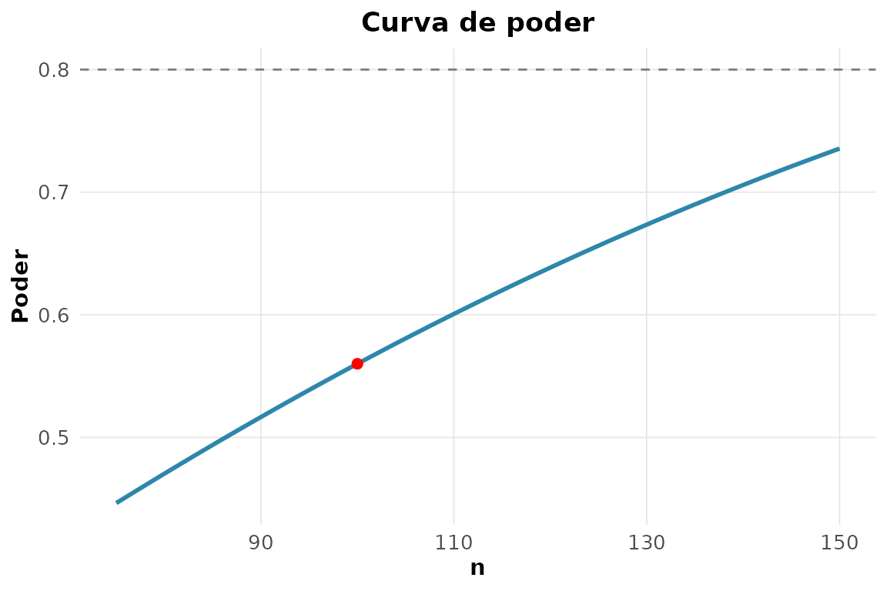

**14. Normalidade de `chickwts$weight` por três métodos.**

``` r

rnp_teste_normalidade(chickwts$weight)
#> # A tibble: 1 × 3
#>   estatistica p_valor metodo 
#>         <dbl>   <dbl> <chr>  
#> 1       0.977   0.210 shapiro
```

**15. Teste de Wald e razão de verossimilhanças.**

``` r

m1 <- glm(am ~ wt + hp, mtcars, family = binomial())
m0 <- glm(am ~ wt,      mtcars, family = binomial())
rnp_teste_wald(m1)
#> # A tibble: 3 × 5
#>   termo       estimativa erro_padrao     z p_valor
#>   <chr>            <dbl>       <dbl> <dbl>   <dbl>
#> 1 (Intercept)    18.9         7.44    2.53  0.0113
#> 2 wt             -8.08        3.07   -2.63  0.0084
#> 3 hp              0.0363      0.0177  2.04  0.0409
rnp_teste_razao_veross(m1, m0)
#> # A tibble: 1 × 3
#>   estatistica    gl p_valor
#>         <dbl> <int>   <dbl>
#> 1        9.12     1  0.0025
```

**16. Atualização Beta(1,1) com 8 sucessos em 10 ensaios.**

``` r

rnp_bayes_conjugada("beta_binomial", priori = c(a = 1, b = 1),
                    dados = list(sucessos = 8, n = 10))
#> # A tibble: 2 × 5
#>   parametro valor media_post ic_inf ic_sup
#>   <chr>     <dbl>      <dbl>  <dbl>  <dbl>
#> 1 a             9       0.75  0.482  0.940
#> 2 b             3       0.75  0.482  0.940
```

## Capítulo 4 — Regressão e modelagem

**1. Ajuste `medv ~ rm + lstat + crim`.**

``` r

ajuste <- rnp_regressao(medv ~ rm + lstat + crim, Boston)
ajuste$coeficientes
#> # A tibble: 4 × 7
#>   termo       estimativa erro_padrao estatistica_t p_valor ic_inf ic_sup
#>   <chr>            <dbl>       <dbl>         <dbl>   <dbl>  <dbl>  <dbl>
#> 1 (Intercept)     -2.56       3.17          -0.809  0.419  -8.78   3.66 
#> 2 rm               5.22       0.442         11.8    0       4.35   6.09 
#> 3 lstat           -0.578      0.0477       -12.1    0      -0.672 -0.485
#> 4 crim            -0.103      0.032         -3.21   0.0014 -0.166 -0.04
```

Cada quarto adicional (`rm`) eleva o valor mediano em cerca de 5 mil
dólares, mantidos os demais preditores.

**2. Fração da variância explicada.**

``` r

ajuste$modelo[, c("r2", "r2_ajustado")]
#> # A tibble: 1 × 2
#>      r2 r2_ajustado
#>   <dbl>       <dbl>
#> 1 0.646       0.644
```

**3. Diagnóstico gráfico dos resíduos.**

``` r

rnp_grafico_residuos(lm(medv ~ rm + lstat + crim, Boston))$residuo_ajustado
```

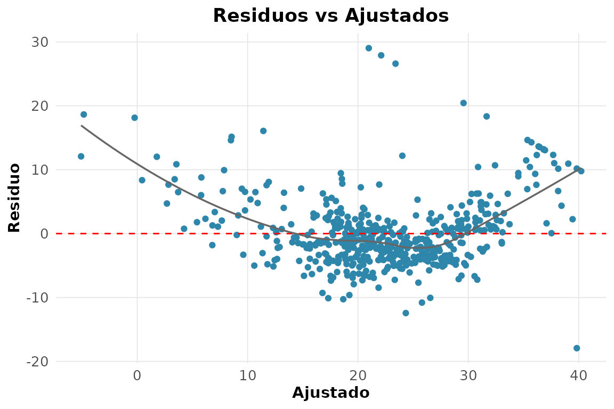

**4. Testes formais de pressupostos.**

``` r

rnp_regressao_diagnosticos(medv ~ rm + lstat + crim, Boston)$testes
#> # A tibble: 3 × 4
#>   teste                   estatistica p_valor interpretacao                   
#>   <chr>                         <dbl>   <dbl> <chr>                           
#> 1 shapiro-wilk (residuos)       0.891       0 Rejeita normalidade             
#> 2 breusch-pagan                73.8         0 Heterocedasticidade             
#> 3 durbin-watson                 0.822      NA Possivel autocorrelacao positiva
```

**5. VIF: há colinearidade?**

``` r

rnp_vif(lm(medv ~ rm + tax + rad + age, Boston))
#> # A tibble: 4 × 3
#>   termo   vif interpretacao
#>   <chr> <dbl> <chr>        
#> 1 rm     1.13 baixa        
#> 2 tax    6.52 moderada     
#> 3 rad    5.95 moderada     
#> 4 age    1.36 baixa
```

Valores próximos de 1–2 indicam colinearidade modesta entre esses
preditores.

**6. Ridge e lasso no mesmo modelo.**

``` r

rnp_regressao_lasso(medv ~ rm + lstat + crim, Boston)
#> # A tibble: 4 × 2
#>   termo       estimativa
#>   <chr>            <dbl>
#> 1 (Intercept)    -2.02  
#> 2 rm              5.12  
#> 3 lstat          -0.575 
#> 4 crim           -0.0943
```

**7. Efeito da penalização sobre os coeficientes.**

``` r

rnp_regressao_ridge(medv ~ rm + lstat + crim, Boston)
#> # A tibble: 4 × 2
#>   termo       estimativa
#>   <chr>            <dbl>
#> 1 (Intercept)     -2.54 
#> 2 rm               5.21 
#> 3 lstat           -0.578
#> 4 crim            -0.103
```

Aumentar a penalização encolhe os coeficientes em direção a zero; o
lasso pode zerá-los, o ridge apenas os reduz.

**8. `dist ~ speed`: linear vs polinomial de grau 2.**

``` r

rnp_regressao_polinomial(dist ~ speed, cars, grau = 2)$modelo
#> # A tibble: 1 × 4
#>      r2 r2_ajustado sigma  nobs
#>   <dbl>       <dbl> <dbl> <int>
#> 1 0.667       0.653  15.2    50
```

**9. Box-Cox em `medv ~ rm + lstat`.**

``` r

rnp_box_cox(medv ~ rm + lstat, Boston)$lambda
#> [1] 0.2
```

**10. IC da média e intervalo de predição.**

``` r

modelo <- lm(medv ~ rm + lstat, Boston)
novo <- data.frame(rm = 6.5, lstat = 8)
rnp_predicao(modelo, novo, tipo = "confianca")
#> # A tibble: 1 × 3
#>   ajuste limite_inferior limite_superior
#>    <dbl>           <dbl>           <dbl>
#> 1   26.6            26.0            27.2
rnp_predicao(modelo, novo, tipo = "predicao")
#> # A tibble: 1 × 3
#>   ajuste limite_inferior limite_superior
#>    <dbl>           <dbl>           <dbl>
#> 1   26.6            15.7            37.5
```

O intervalo de predição é mais largo: incorpora a variância de uma
observação individual, além da incerteza sobre a média.

**11. Regressão de Poisson.**

``` r

rnp_regressao_poisson(gear ~ mpg, mtcars)$coeficientes
#> # A tibble: 2 × 5
#>   termo       estimativa erro_padrao p_valor   irr
#>   <chr>            <dbl>       <dbl>   <dbl> <dbl>
#> 1 (Intercept)     0.989       0.325   0.0023  2.69
#> 2 mpg             0.0155      0.0151  0.304   1.02
```

**12. Regressão logística `am ~ wt + hp`.**

``` r

log_fit <- rnp_logistic(am ~ wt + hp, mtcars)
log_fit$coeficientes[, c("termo", "estimativa", "odds_ratio", "p_valor")]
#> # A tibble: 3 × 4
#>   termo       estimativa odds_ratio p_valor
#>   <chr>            <dbl>      <dbl>   <dbl>
#> 1 (Intercept)    18.9       1.56e+8  0.0113
#> 2 wt             -8.08      3   e-4  0.0084
#> 3 hp              0.0363    1.04e+0  0.0409
```

Cada tonelada a mais reduz drasticamente a chance de câmbio manual
(razão de chances bem abaixo de 1).

**13. Curva ROC e AUC.**

``` r

prob <- predict(glm(am ~ wt + hp, mtcars, family = binomial()), type = "response")
rnp_curva_roc(mtcars$am, prob, positivo = 1)$auc
#> [1] 0.9838
```

**14. Matriz de confusão no limiar 0,5.**

``` r

rnp_matriz_confusao(mtcars$am, as.integer(prob > 0.5))$matriz
#>    pred
#> obs  0  1
#>   0 18  1
#>   1  1 12
```

**15. Regressão robusta com um outlier.**

``` r

boston_out <- Boston
boston_out$medv[1] <- 200            # outlier artificial
rnp_regressao_robusta(medv ~ rm + lstat, boston_out)$coeficientes
#> # A tibble: 3 × 2
#>   termo       estimativa
#>   <chr>            <dbl>
#> 1 (Intercept)     -5.58 
#> 2 rm               5.61 
#> 3 lstat           -0.608
```

A regressão robusta atribui peso menor ao ponto discrepante, mantendo os
coeficientes próximos dos do ajuste sem o outlier.

## Capítulo 5 — Análise multivariada

**1. Matriz de correlação de `mtcars`.**

``` r

rnp_matriz_correlacao(mtcars)$matriz[1:4, 1:4]
#>          mpg     cyl    disp      hp
#> mpg   1.0000 -0.8522 -0.8476 -0.7762
#> cyl  -0.8522  1.0000  0.9020  0.8324
#> disp -0.8476  0.9020  1.0000  0.7909
#> hp   -0.7762  0.8324  0.7909  1.0000
```

`mpg` correlaciona-se fortemente (e negativamente) com `wt`, `hp`,
`disp` e `cyl`.

**2. Correlograma.**

``` r

rnp_grafico_correlograma(mtcars)
```

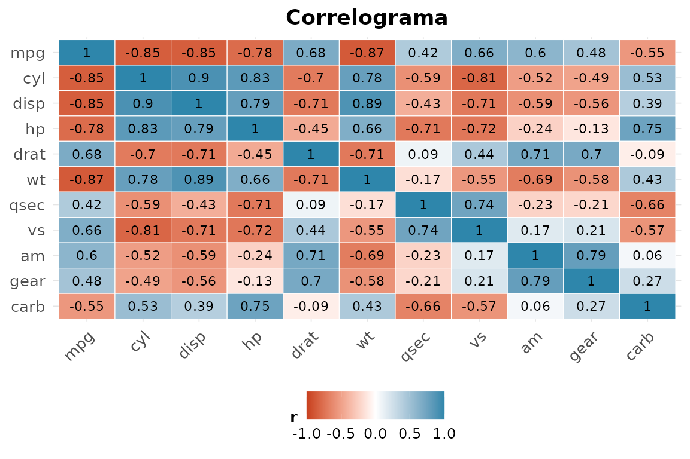

**3. PCA de `USArrests`: quantos componentes para 90%?**

``` r

rnp_pca(USArrests)$variancia
#> # A tibble: 4 × 4
#>   componente variancia percentual acumulada
#>   <chr>          <dbl>      <dbl>     <dbl>
#> 1 PC1            2.48      0.620      0.620
#> 2 PC2            0.990     0.247      0.868
#> 3 PC3            0.357     0.0891     0.957
#> 4 PC4            0.173     0.0434     1
```

Três componentes acumulam cerca de 95% da variância; dois já passam de
85%.

**4. Biplot da PCA.**

``` r

rnp_biplot(rnp_pca(USArrests))
```

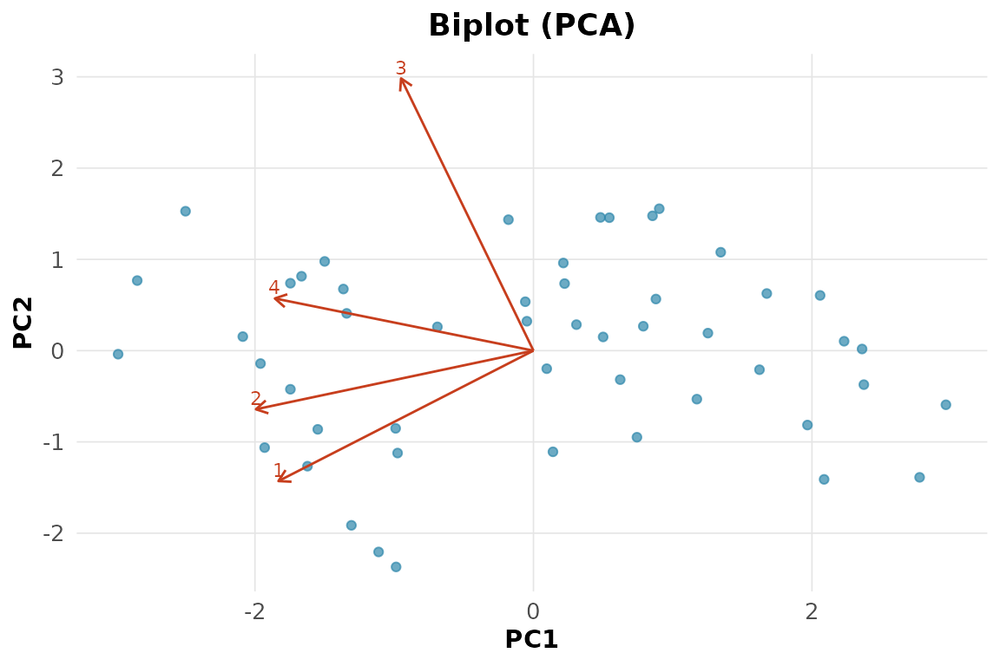

**5. K-médias com $`k = 4`$.**

``` r

rnp_kmeans(USArrests, k = 4)$metricas
#> # A tibble: 1 × 5
#>   wss_total between_ss ratio_ss     k  nobs
#>       <dbl>      <dbl>    <dbl> <dbl> <int>
#> 1      56.4       140.    0.712     4    50
```

**6. Dendrograma do agrupamento hierárquico.**

``` r

rnp_grafico_dendrograma(rnp_cluster_hierarquico(USArrests, k = 4))
```

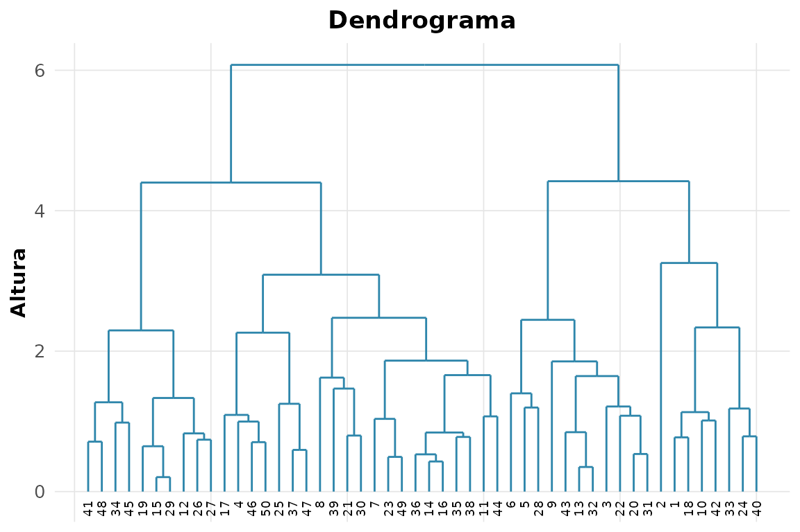

**7. Silhueta média para $`k = 2, 3, 4`$.**

``` r

sapply(2:4, function(k)
  rnp_silhueta(USArrests, rnp_kmeans(USArrests, k = k)$clusters$cluster)$media)
#> [1] 0.5407 0.3623 0.2113
```

O maior valor médio aponta o melhor número de grupos.

**8. K-medoids comparado ao k-médias.**

``` r

rnp_kmedoids(USArrests, k = 4)$medoides
#> [1]  1 16 19 22
```

**9. Distâncias de Mahalanobis das 10 primeiras flores.**

``` r

as.matrix(rnp_distancia(iris[1:10, 1:4], method = "mahalanobis"))[1:5, 1:5]
#>          1        2        3        4        5
#> 1 0.000000 2.735288 1.578257 3.003490 1.341259
#> 2 2.735288 0.000000 2.472820 3.474220 3.889974
#> 3 1.578257 2.472820 0.000000 2.807279 2.082353
#> 4 3.003490 3.474220 2.807279 0.000000 2.865974
#> 5 1.341259 3.889974 2.082353 2.865974 0.000000
```

**10. MDS de uma matriz de distâncias.**

``` r

rnp_mds(dist(USArrests))$pontos[1:5, ]
#> # A tibble: 5 × 2
#>     Dim1   Dim2
#>    <dbl>  <dbl>
#> 1  -64.8  11.4 
#> 2  -92.8  18.0 
#> 3 -124.   -8.83
#> 4  -18.3  16.7 
#> 5 -107.  -22.5
```

**11. LDA para as espécies de `iris`.**

``` r

rnp_lda(Species ~ ., iris)$acuracia
#> [1] 0.98
```

**12. Análise fatorial de `swiss` com 2 fatores.**

``` r

rnp_analise_fatorial(swiss, n_fatores = 2)$cargas
#> # A tibble: 6 × 3
#>   variavel          Fator1  Fator2
#>   <chr>              <dbl>   <dbl>
#> 1 Fertility        -0.652   0.393 
#> 2 Agriculture      -0.630   0.333 
#> 3 Examination       0.685  -0.510 
#> 4 Education         0.997  -0.0313
#> 5 Catholic         -0.124   0.961 
#> 6 Infant.Mortality -0.0947  0.175
```

**13. $`T^2`$ de Hotelling entre duas espécies.**

``` r

rnp_hotelling(iris[iris$Species == "setosa", 1:4],
              iris[iris$Species == "versicolor", 1:4])
#> # A tibble: 1 × 5
#>      t2 estatistica_f   gl1   gl2 p_valor
#>   <dbl>         <dbl> <int> <dbl>   <dbl>
#> 1 2581.          625.     4    95       0
```

A diferença entre os vetores de média é altamente significativa.

**14. MANOVA entre as três espécies.**

``` r

rnp_manova(cbind(Sepal.Length, Sepal.Width, Petal.Length, Petal.Width) ~ Species,
           iris)
#> # A tibble: 2 × 4
#>   teste  estatistica aprox_f p_valor
#>   <chr>        <dbl>   <dbl>   <dbl>
#> 1 Wilks       0.0234   199.        0
#> 2 Pillai      1.19      53.5       0
```

**15. Normalidade multivariada das quatro medidas.**

``` r

rnp_normalidade_multivariada(iris[, 1:4])
#> # A tibble: 2 × 3
#>   medida     estatistica p_valor
#>   <chr>            <dbl>   <dbl>
#> 1 assimetria      67.4     0    
#> 2 curtose         -0.230   0.818
```

**16. Correlação canônica entre sépala e pétala.**

``` r

rnp_correlacao_canonica(iris[, 1:2], iris[, 3:4])
#> # A tibble: 2 × 2
#>   dimensao correlacao_canonica
#>      <int>               <dbl>
#> 1        1               0.941
#> 2        2               0.124
```

## Capítulo 6 — Dados categóricos e não-paramétricos

**1. Tabela de contingência etnia × baixo peso.**

``` r

rnp_tabela_contingencia(birthwt$race, birthwt$low)
#> # A tibble: 3 × 4
#>   categoria   `0`   `1` Total
#>   <chr>     <int> <int> <dbl>
#> 1 1            73    23    96
#> 2 2            15    11    26
#> 3 3            42    25    67
```

**2. Qui-quadrado e V de Cramér.**

``` r

rnp_teste_qui_quadrado(birthwt$race, birthwt$low)
#> # A tibble: 1 × 5
#>   estatistica    gl p_valor v_cramer metodo       
#>         <dbl> <int>   <dbl>    <dbl> <chr>        
#> 1        5.00     2  0.0819    0.163 independencia
```

**3. Teste exato de Fisher numa tabela $`2\times2`$.**

``` r

rnp_teste_fisher(table(birthwt$ht, birthwt$low))
#> # A tibble: 1 × 4
#>   p_valor odds_ratio ic_inf ic_sup
#>     <dbl>      <dbl>  <dbl>  <dbl>
#> 1  0.0516       3.34  0.868   14.0
```

**4. Razão de chances e risco relativo (hipertensão × baixo peso).**

``` r

rnp_odds_ratio(table(birthwt$ht, birthwt$low))[, c("odds_ratio", "ic_inf", "ic_sup")]
#> # A tibble: 1 × 3
#>   odds_ratio ic_inf ic_sup
#>        <dbl>  <dbl>  <dbl>
#> 1       3.37   1.02   11.1
rnp_risco_relativo(table(birthwt$ht, birthwt$low))[, c("risco_relativo", "ic_inf", "ic_sup")]
#> # A tibble: 1 × 3
#>   risco_relativo ic_inf ic_sup
#>            <dbl>  <dbl>  <dbl>
#> 1           1.69  0.862   3.33
```

A razão de chances supera o risco relativo, como esperado quando o
desfecho não é raro.

**5. Kappa de Cohen.**

``` r

rnp_kappa(c(1, 1, 0, 1, 0, 1, 1, 0), c(1, 0, 0, 1, 0, 1, 1, 1))
#> # A tibble: 1 × 3
#>   kappa concordancia_observada concordancia_esperada
#>   <dbl>                  <dbl>                 <dbl>
#> 1 0.467                   0.75                 0.531
```

**6. `mtcars$mpg` é Normal?**

``` r

rnp_teste_normalidade(mtcars$mpg)
#> # A tibble: 1 × 3
#>   estatistica p_valor metodo 
#>         <dbl>   <dbl> <chr>  
#> 1       0.948   0.123 shapiro
```

**7. `mpg` por câmbio: Mann-Whitney.**

``` r

rnp_mann_whitney(mtcars$mpg[mtcars$am == 1], mtcars$mpg[mtcars$am == 0])
#> # A tibble: 1 × 4
#>   estatistica p_valor metodo                       alternativa
#>         <dbl>   <dbl> <chr>                        <chr>      
#> 1         205  0.0012 Wilcoxon rank sum exact test bilateral
```

**8. A mesma comparação por teste t.**

``` r

rnp_teste_t(mtcars$mpg[mtcars$am == 1], mtcars$mpg[mtcars$am == 0])
#> # A tibble: 1 × 10
#>   estatistica    gl p_valor media_x media_y  diff ic_inf ic_sup hipotese_nula
#>         <dbl> <dbl>   <dbl>   <dbl>   <dbl> <dbl>  <dbl>  <dbl>         <dbl>
#> 1        3.77  18.3  0.0014    24.4    17.1  7.24   3.21   11.3             0
#> # ℹ 1 more variable: alternativa <chr>
```

A conclusão (diferença significativa) é a mesma do Mann-Whitney.

**9. Wilcoxon pareado em `sleep`.**

``` r

rnp_wilcoxon(sleep$extra[sleep$group == 1], sleep$extra[sleep$group == 2])
#> # A tibble: 1 × 4
#>   estatistica p_valor metodo                          alternativa
#>         <dbl>   <dbl> <chr>                           <chr>      
#> 1           0  0.0039 Wilcoxon signed rank exact test bilateral
```

**10. Kruskal-Wallis em `InsectSprays`.**

``` r

rnp_kruskal(InsectSprays$count, InsectSprays$spray)
#> # A tibble: 1 × 4
#>   estatistica    gl p_valor metodo        
#>         <dbl> <int>   <dbl> <chr>         
#> 1        54.7     5       0 kruskal-wallis
```

**11. A mesma comparação por ANOVA.**

``` r

rnp_anova(count ~ spray, data = InsectSprays)$anova
#> # A tibble: 3 × 6
#>   fonte            gl soma_quadrados media_quadrados estatistica_F p_valor
#>   <chr>         <dbl>          <dbl>           <dbl>         <dbl>   <dbl>
#> 1 "g          "     5          2669.           534.           34.7       0
#> 2 "Residuals  "    66          1015.            15.4          NA        NA
#> 3 "total"          71          3684             NA            NA        NA
```

ANOVA e Kruskal-Wallis concordam: há diferença forte entre os sprays.

**12. Aderência de `mtcars$cyl` a proporções uniformes.**

``` r

rnp_teste_qui_quadrado(as.numeric(table(mtcars$cyl)), p = rep(1/3, 3))
#> # A tibble: 1 × 4
#>   estatistica    gl p_valor metodo   
#>         <dbl> <dbl>   <dbl> <chr>    
#> 1        2.31     2   0.315 aderencia
```

**13. Aderência de `Pima.tr$bmi` à Normal.**

``` r

rnp_teste_aderencia(Pima.tr$bmi, "norm")
#> # A tibble: 1 × 4
#>   estatistica    gl p_valor     k
#>         <dbl> <int>   <dbl> <int>
#> 1        1800     9       0    10
```

**14. Teste de McNemar numa tabela pareada.**

``` r

antes  <- factor(c(1, 1, 0, 1, 0, 0, 1, 1, 0, 1))
depois <- factor(c(1, 0, 0, 1, 1, 0, 1, 0, 0, 1))
rnp_teste_mcnemar(antes, depois)
#> # A tibble: 1 × 4
#>   estatistica    gl p_valor metodo 
#>         <dbl> <dbl>   <dbl> <chr>  
#> 1           0     1       1 mcnemar
```

**15. W de Kendall entre três avaliadores.**

``` r

avaliacoes <- matrix(c(1, 2, 3,  2, 3, 1,  1, 3, 2,  1, 2, 3),
                     ncol = 3, byrow = TRUE)
rnp_teste_kendall_w(avaliacoes)
#> # A tibble: 1 × 5
#>       W estatistica    gl p_valor metodo   
#>   <dbl>       <dbl> <dbl>   <dbl> <chr>    
#> 1 0.311         2.8     3   0.424 kendall-w
```

## Capítulo 7 — Análise de sobrevivência

``` r

lung2 <- lung
lung2$ev <- lung2$status - 1   # 1 = óbito, 0 = censura
```

**1. Kaplan-Meier global e sobrevida mediana.**

``` r

rnp_kaplan_meier(lung2$time, lung2$ev)$mediana
#> # A tibble: 1 × 6
#>   grupo     n eventos mediana ic_inf ic_sup
#>   <chr> <int>   <int>   <dbl>  <dbl>  <dbl>
#> 1 todos   228     165     310    285    363
```

**2. Curva estratificada pelo estado funcional `ph.ecog`.**

``` r

rnp_grafico_sobrevivencia(rnp_kaplan_meier(lung2$time, lung2$ev,
                                           grupo = lung2$ph.ecog))
```

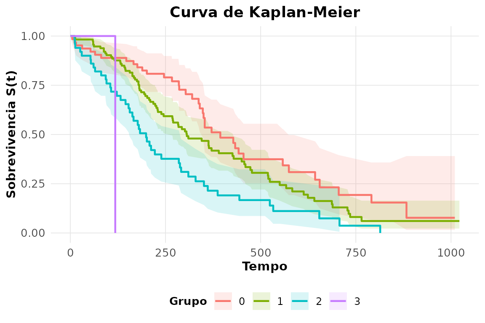

**3. Comparação por sexo (log-rank).**

``` r

rnp_log_rank(lung2$time, lung2$ev, lung2$sex)
#> # A tibble: 1 × 4
#>   estatistica    gl p_valor metodo  
#>         <dbl> <int>   <dbl> <chr>   
#> 1        10.3     1  0.0013 log-rank
```

**4. A mesma comparação por Gehan-Wilcoxon (`rho = 1`).**

``` r

rnp_log_rank(lung2$time, lung2$ev, lung2$sex, rho = 1)
#> # A tibble: 1 × 4
#>   estatistica    gl p_valor metodo        
#>         <dbl> <int>   <dbl> <chr>         
#> 1        12.7     1  0.0004 gehan-wilcoxon
```

A conclusão (diferença entre os sexos) se mantém, com peso maior nos
tempos iniciais.

**5. Risco acumulado de Nelson-Aalen.**

``` r

head(rnp_nelson_aalen(lung2$time, lung2$ev), 5)
#> # A tibble: 5 × 5
#>   tempo n_risco n_evento risco_acumulado     ep
#>   <dbl>   <dbl>    <dbl>           <dbl>  <dbl>
#> 1     5     228        1          0.0044 0.0044
#> 2    11     227        3          0.0176 0.0088
#> 3    12     224        1          0.0221 0.0099
#> 4    13     223        2          0.031  0.0117
#> 5    15     221        1          0.0356 0.0126
```

O risco acumulado equivale a $`-\log \hat{S}(t)`$ da estimativa de
Kaplan-Meier.

**6. Modelo de Cox com `age`, `sex` e `ph.karno`.**

``` r

cox_fit <- rnp_cox(Surv(time, status) ~ age + sex + ph.karno, lung)
cox_fit$coeficientes
#> # A tibble: 3 × 8
#>   termo       coef hazard_ratio erro_padrao     z p_valor ic_inf ic_sup
#>   <chr>      <dbl>        <dbl>       <dbl> <dbl>   <dbl>  <dbl>  <dbl>
#> 1 age       0.0124        1.01       0.0094  1.32  0.188   0.994  1.03 
#> 2 sex      -0.497         0.608      0.168  -2.96  0.003   0.438  0.845
#> 3 ph.karno -0.0133        0.987      0.0059 -2.27  0.0235  0.976  0.998
```

Ser do sexo feminino (`sex = 2`) reduz o risco; a razão de risco abaixo
de 1 confirma melhor prognóstico.

**7. Hipótese de riscos proporcionais.**

``` r

rnp_cox_diagnosticos(cox_fit)$teste
#> # A tibble: 4 × 5
#>   termo     chisq    gl p_valor interpretacao   
#>   <chr>     <dbl> <dbl>   <dbl> <chr>           
#> 1 age       0.478     1  0.489  PH nao rejeitada
#> 2 sex       3.09      1  0.079  PH nao rejeitada
#> 3 ph.karno  8.02      1  0.0046 viola PH        
#> 4 GLOBAL   10.4       3  0.0157 viola PH
```

**8. Risco relativo para perfis de 50 e 70 anos.**

``` r

rnp_cox_risco_relativo(rnp_cox(Surv(time, status) ~ age, lung),
                       data.frame(age = c(50, 70)))
#> # A tibble: 2 × 2
#>     age risco_relativo
#>   <dbl>          <dbl>
#> 1    50          0.792
#> 2    70          1.15
```

**9. AFT Weibull, lognormal e exponencial: comparação de AIC.**

``` r

sapply(c("weibull", "lognormal", "exponential"), function(d)
  rnp_sobrevivencia_parametrica(Surv(time, status) ~ age, lung, dist = d)$aic)
#>     weibull   lognormal exponential 
#>    2309.788    2334.712    2324.896
```

**10. Tábua de vida em intervalos de 200 dias.**

``` r

rnp_tabela_vida(lung2$time, lung2$ev, intervalos = seq(0, 1000, 200))
#> # A tibble: 5 × 8
#>   intervalo   n_inicio n_evento n_censura n_risco prob_evento prob_sobrevivencia
#>   <chr>          <int>    <int>     <int>   <dbl>       <dbl>              <dbl>
#> 1 [0,200)          226       72        12   220         0.327              0.673
#> 2 [200,400)        142       54        33   126.        0.430              0.570
#> 3 [400,600)         55       22        11    49.5       0.444              0.556
#> 4 [600,800)         22       15         1    21.5       0.698              0.302
#> 5 [800,1e+03]        6        2         4     4         0.5                0.5  
#> # ℹ 1 more variable: sobrevivencia_acumulada <dbl>
```

**11. `veteran`: sobrevida por tipo de tratamento (log-rank).**

``` r

rnp_log_rank(veteran$time, veteran$status, veteran$trt)
#> # A tibble: 1 × 4
#>   estatistica    gl p_valor metodo  
#>         <dbl> <int>   <dbl> <chr>   
#> 1      0.0082     1   0.928 log-rank
```

Não há diferença significativa entre os dois tratamentos.

**12. Cox em `veteran` com `karno` e `celltype`.**

``` r

rnp_cox(Surv(time, status) ~ karno + celltype, veteran)$coeficientes
#> # A tibble: 4 × 8
#>   termo                coef hazard_ratio erro_padrao     z p_valor ic_inf ic_sup
#>   <chr>               <dbl>        <dbl>       <dbl> <dbl>   <dbl>  <dbl>  <dbl>
#> 1 karno             -0.0311        0.969      0.0052 -6.00  0       0.960  0.979
#> 2 celltypesmallcell  0.715         2.04       0.253   2.83  0.0046  1.25   3.36 
#> 3 celltypeadeno      1.16          3.18       0.293   3.95  0.0001  1.79   5.65 
#> 4 celltypelarge      0.326         1.38       0.277   1.18  0.239   0.805  2.38
```

O estado funcional `karno` é o fator de maior peso: cada ponto a mais
reduz o risco.

**13. `ovarian`: Kaplan-Meier por grupo de tratamento.**

``` r

rnp_kaplan_meier(ovarian$futime, ovarian$fustat, grupo = ovarian$rx)$mediana
#> # A tibble: 2 × 6
#>   grupo     n eventos mediana ic_inf ic_sup
#>   <chr> <int>   <int>   <dbl>  <dbl>  <dbl>
#> 1 1        13       7     638    268     NA
#> 2 2        13       5      NA    475     NA
```

**14. Concordância (C de Harrell) de dois modelos de Cox.**

``` r

c(idade        = rnp_cox(Surv(time, status) ~ age, lung)$modelo$concordancia,
  idade_karno  = rnp_cox(Surv(time, status) ~ age + ph.karno, lung)$modelo$concordancia)
#>       idade idade_karno 
#>      0.5502      0.6046
```

Acrescentar `ph.karno` melhora a capacidade de ordenar os tempos de
sobrevida.

## Capítulo 8 — Séries temporais

**1. `UKgas` é estacionária? Testes ADF e KPSS.**

``` r

rnp_ts_adf(UKgas)
#> # A tibble: 1 × 5
#>   estatistica   lag valor_critico_5 p_valor_aprox estacionaria
#>         <dbl> <dbl>           <dbl>         <dbl> <lgl>       
#> 1        3.49     4           -2.86           0.1 FALSE
rnp_ts_kpss(UKgas)
#> # A tibble: 1 × 3
#>   estatistica valor_critico_5 estacionaria
#>         <dbl>           <dbl> <lgl>       
#> 1        2.12           0.463 FALSE
```

O ADF não rejeita a raiz unitária e o KPSS rejeita a estacionariedade: a
série não é estacionária.

**2. Estabilizar a variância e diferenciar.**

``` r

ukgas_d <- rnp_ts_diferenciacao(log(UKgas))
rnp_ts_adf(ukgas_d)$estacionaria
#>   x2 
#> TRUE
```

**3. ACF e PACF da série diferenciada.**

``` r

rnp_grafico_acf(diff(lh))
```

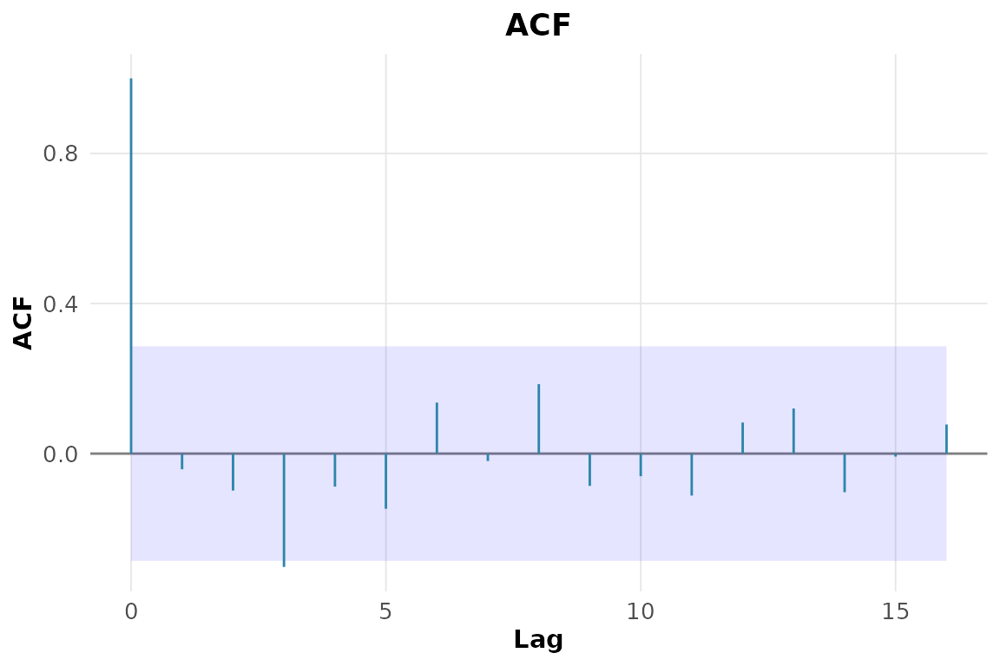

**4. Seleção automática da ordem ARIMA de `lh`.**

``` r

rnp_auto_arima(lh)$selecao
#> # A tibble: 5 × 4
#>       p     d     q criterio_aicc
#>   <int> <int> <int>         <dbl>
#> 1     0     0     2          63.6
#> 2     1     0     0          65.0
#> 3     2     0     0          65.0
#> 4     3     0     0          65.1
#> 5     0     1     3          65.8
```

**5. Ajuste do modelo escolhido.**

``` r

rnp_arima(lh, ordem = c(1, 0, 0))$coeficientes
#> # A tibble: 2 × 5
#>   termo     estimativa erro_padrao     z p_valor
#>   <chr>          <dbl>       <dbl> <dbl>   <dbl>
#> 1 ar1            0.574       0.116  4.94       0
#> 2 intercept      2.41        0.147 16.5        0
```

**6. Diagnóstico dos resíduos (Ljung-Box).**

``` r

rnp_ts_residuos(rnp_arima(lh, ordem = c(1, 0, 0)))
#> # A tibble: 2 × 4
#>   teste        estatistica p_valor interpretacao    
#>   <chr>              <dbl>   <dbl> <chr>            
#> 1 ljung-box          9.36   0.313  ruido branco (ok)
#> 2 shapiro-wilk       0.932  0.0083 nao-normal
```

**7. SARIMA para o log de `AirPassengers`.**

``` r

sarima_fit <- rnp_sarima(log(AirPassengers), ordem = c(0, 1, 1),
                         sazonal = c(0, 1, 1), periodo = 12)
sarima_fit$coeficientes
#> # A tibble: 2 × 5
#>   termo estimativa erro_padrao     z p_valor
#>   <chr>      <dbl>       <dbl> <dbl>   <dbl>
#> 1 ma1       -0.402      0.0896 -4.48       0
#> 2 sma1      -0.557      0.0731 -7.62       0
```

**8. Previsão de 24 meses com intervalos.**

``` r

rnp_ts_previsao(sarima_fit, h = 24)$grafico
```

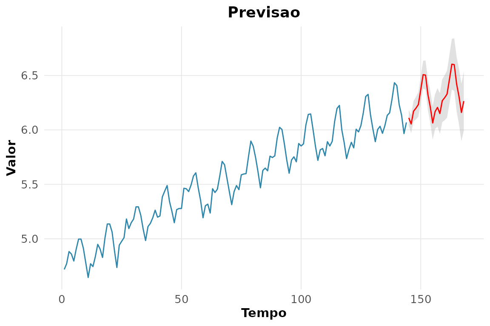

**9. Média móvel de 12 meses.**

``` r

head(rnp_media_movel(AirPassengers, k = 12), 8)
#> # A tibble: 8 × 3
#>   tempo original media_movel
#>   <int>    <dbl>       <dbl>
#> 1     1      112        NaN 
#> 2     2      118        NaN 
#> 3     3      132        NaN 
#> 4     4      129        NaN 
#> 5     5      121        NaN 
#> 6     6      135        NaN 
#> 7     7      148        127.
#> 8     8      148        127.
```

**10. Suavização exponencial.**

``` r

head(rnp_suavizacao_exponencial(AirPassengers), 6)
#> # A tibble: 6 × 3
#>   tempo original suavizada
#>   <int>    <dbl>     <dbl>
#> 1     1      112      112 
#> 2     2      118      114.
#> 3     3      132      119.
#> 4     4      129      122.
#> 5     5      121      122.
#> 6     6      135      126.
```

**11. Decomposição de `nottem`.**

``` r

rnp_ts_decomposicao(nottem)$componentes |> head()
#> # A tibble: 6 × 6
#>   observacao tempo observada tendencia sazonal aleatorio
#>        <int> <dbl>     <dbl>     <dbl>   <dbl>     <dbl>
#> 1          1 1920       40.6        NA   -9.34        NA
#> 2          2 1920.      40.8        NA   -9.90        NA
#> 3          3 1920.      44.4        NA   -6.95        NA
#> 4          4 1920.      46.7        NA   -2.76        NA
#> 5          5 1920.      54.1        NA    3.45        NA
#> 6          6 1920.      58.5        NA    8.99        NA
```

**12. Holt-Winters em `AirPassengers`.**

``` r

rnp_ts_holt_winters(AirPassengers)$parametros
#> # A tibble: 1 × 3
#>   alpha   beta gamma
#>   <dbl>  <dbl> <dbl>
#> 1 0.248 0.0345     1
```

**13. Periodograma de `sunspot.year`.**

``` r

periodo <- rnp_ts_periodograma(sunspot.year)
periodo[which.max(periodo$densidade), ]
#> # A tibble: 1 × 3
#>   frequencia periodo densidade
#>        <dbl>   <dbl>     <dbl>
#> 1       0.09    11.1    57689.
```

O pico do periodograma reproduz o conhecido ciclo solar de cerca de 11
anos.

**14. VAR(2) e causalidade de Granger (`mdeaths`, `fdeaths`).**

``` r

rnp_ts_var(cbind(mdeaths, fdeaths), p = 2)$granger
#> # A tibble: 2 × 4
#>   causa   efeito  estatistica_f p_valor
#>   <chr>   <chr>           <dbl>   <dbl>
#> 1 fdeaths mdeaths          1.44  0.244 
#> 2 mdeaths fdeaths          2.73  0.0724
```

**15. GARCH(1,1) numa série de retornos.**

``` r

set.seed(1)
retornos <- diff(log(cumsum(abs(rnorm(500))) + 100))
rnp_ts_garch(retornos)$parametros
#> # A tibble: 4 × 2
#>   parametro estimativa
#>   <chr>          <dbl>
#> 1 mu            0.0032
#> 2 omega         0     
#> 3 alpha         0.0424
#> 4 beta          0.951
```

## Capítulo 9 — Modelos lineares generalizados e extensões

**1. GLM Poisson para `breaks ~ wool + tension`.**

``` r

pois <- rnp_glm(breaks ~ wool + tension, warpbreaks, familia = "poisson")
pois$coeficientes
#> # A tibble: 4 × 7
#>   termo       estimativa erro_padrao estatistica p_valor ic_inf ic_sup
#>   <chr>            <dbl>       <dbl>       <dbl>   <dbl>  <dbl>  <dbl>
#> 1 (Intercept)      3.69       0.0454       81.3   0       3.60   3.78 
#> 2 woolB           -0.206      0.0516       -3.99  0.0001 -0.307 -0.105
#> 3 tensionM        -0.321      0.0603       -5.33  0      -0.439 -0.203
#> 4 tensionH        -0.518      0.064        -8.11  0      -0.644 -0.393
```

A tensão alta reduz a taxa de quebras; a razão de taxas (exponencial do
coeficiente) fica abaixo de 1.

**2. Diagnóstico de superdispersão.**

``` r

rnp_glm_diagnosticos(pois)$testes
#> # A tibble: 3 × 4
#>   medida                   valor p_valor interpretacao                 
#>   <chr>                    <dbl>   <dbl> <chr>                         
#> 1 dispersao                 4.26      NA superdispersao                
#> 2 deviance/gl               4.21      NA NA                            
#> 3 qui-quadrado de Pearson 213.         0 falta de ajuste/superdispersao
```

**3. Binomial negativa em `quine` e comparação de AIC.**

``` r

bn <- rnp_binomial_negativa(Days ~ Sex + Age, quine)
c(poisson = rnp_glm(Days ~ Sex + Age, quine, familia = "poisson")$objeto$aic,
  binom_neg = bn$aic)
#>   poisson binom_neg 
#>  2506.752  1119.813
```

O AIC menor da binomial negativa confirma a superdispersão da contagem
de faltas.

**4. GLM binomial `am ~ wt + hp`.**

``` r

rnp_glm(am ~ wt + hp, mtcars, familia = "binomial")$coeficientes
#> # A tibble: 3 × 7
#>   termo       estimativa erro_padrao estatistica p_valor   ic_inf ic_sup
#>   <chr>            <dbl>       <dbl>       <dbl>   <dbl>    <dbl>  <dbl>
#> 1 (Intercept)    18.9         7.44          2.53  0.0113   4.28   33.5  
#> 2 wt             -8.08        3.07         -2.63  0.0084 -14.1    -2.07 
#> 3 hp              0.0363      0.0177        2.04  0.0409   0.0015  0.071
```

**5. Modelo de odds proporcionais à satisfação (`housing`).**

``` r

rnp_regressao_ordinal(Sat ~ Infl + Type, housing, pesos = housing$Freq)$coeficientes
#> # A tibble: 5 × 5
#>   termo         estimativa erro_padrao p_valor odds_ratio
#>   <chr>              <dbl>       <dbl>   <dbl>      <dbl>
#> 1 InflMedium         0.548       0.104  0           1.73 
#> 2 InflHigh           1.24        0.126  0           3.45 
#> 3 TypeApartment     -0.522       0.118  0           0.594
#> 4 TypeAtrium        -0.289       0.153  0.0592      0.749
#> 5 TypeTerrace       -1.01        0.150  0           0.363
```

**6. Modelo misto `distance ~ age` com intercepto aleatório.**

``` r

misto <- rnp_modelo_misto(distance ~ age, nlme::Orthodont,
                          aleatorio = ~ 1 | Subject)
misto$variancia
#> # A tibble: 3 × 2
#>   componente variancia
#>   <chr>          <dbl>
#> 1 aleatorio      4.47 
#> 2 residuo        2.05 
#> 3 ICC            0.686
```

**7. Interpretação do ICC.**

``` r

v <- misto$variancia$variancia
v[1] / sum(v)   # fração da variância entre indivíduos
#> [1] 0.6204959
```

Boa parte da variabilidade está entre sujeitos, justificando o efeito
aleatório.

**8. GAM `accel ~ s(times)` em `mcycle`.**

``` r

gam_fit <- rnp_gam(accel ~ s(times), mcycle)
gam_fit$suaves
#> # A tibble: 1 × 4
#>   termo      edf estatistica p_valor
#>   <chr>    <dbl>       <dbl>   <dbl>
#> 1 s(times)  8.69        53.5       0
```

Os graus de liberdade efetivos bem acima de 1 revelam forte
não-linearidade.

**9. Efeito suave estimado.**

``` r

rnp_grafico_efeitos(gam_fit)
```

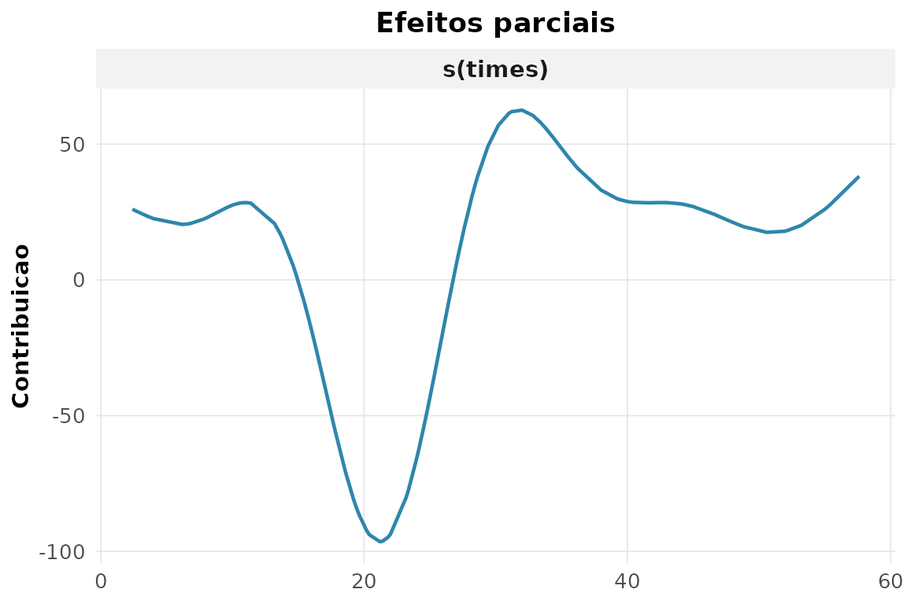

**10. Deviance explicada: GAM vs linear.**

``` r

c(gam = summary(gam_fit$objeto)$dev.expl,
  linear = summary(lm(accel ~ times, mcycle))$r.squared)
#>        gam     linear 
#> 0.79757044 0.08785493
```

O termo suave capta a relação que a reta não consegue.

**11. GLM Gama (ligação log).**

``` r

warp_pos <- transform(warpbreaks, breaks = breaks + 0.5)
rnp_glm(breaks ~ wool + tension, warp_pos, familia = "gamma")$coeficientes
#> # A tibble: 4 × 7
#>   termo       estimativa erro_padrao estatistica p_valor ic_inf  ic_sup
#>   <chr>            <dbl>       <dbl>       <dbl>   <dbl>  <dbl>   <dbl>
#> 1 (Intercept)      3.68        0.102       36.0   0       3.48   3.88  
#> 2 woolB           -0.179       0.102       -1.75  0.0864 -0.379  0.0215
#> 3 tensionM        -0.288       0.125       -2.30  0.0254 -0.534 -0.0431
#> 4 tensionH        -0.501       0.125       -4.00  0.0002 -0.746 -0.256
```

**12. Resíduos de deviance do modelo Poisson.**

``` r

rnp_glm_diagnosticos(pois)$testes
#> # A tibble: 3 × 4
#>   medida                   valor p_valor interpretacao                 
#>   <chr>                    <dbl>   <dbl> <chr>                         
#> 1 dispersao                 4.26      NA superdispersao                
#> 2 deviance/gl               4.21      NA NA                            
#> 3 qui-quadrado de Pearson 213.         0 falta de ajuste/superdispersao
```

## Capítulo 10 — Aprendizado de máquina

Os blocos abaixo dependem dos motores do tidymodels (`rpart`, `ranger`,
`glmnet`, `kknn`). O código é exibido sempre; a execução ocorre quando
esses pacotes estão disponíveis.

**1. Partição 70/30 estratificada por espécie.**

``` r

sp <- rnp_ml_particao(iris, prop = 0.7, estrato = "Species")
sp
#> <Training/Testing/Total>
#> <105/45/150>
```

**2. Validação cruzada com 5 folds.**

``` r

cv <- rnp_ml_cv(iris, v = 5, estrato = "Species")
cv
#> #  5-fold cross-validation using stratification 
#> # A tibble: 5 × 2
#>   splits           id   
#>   <list>           <chr>
#> 1 <split [120/30]> Fold1
#> 2 <split [120/30]> Fold2
#> 3 <split [120/30]> Fold3
#> 4 <split [120/30]> Fold4
#> 5 <split [120/30]> Fold5
```

**3. Receita que normaliza os preditores.**

``` r

rnp_ml_receita(Species ~ ., iris, passos = c("normalizar"))
```

**4. Árvore de decisão e acurácia no teste.**

``` r

arvore <- rnp_ml_ajustar(rnp_ml_arvore("classificacao"), Species ~ ., sp)
arvore$metricas
#> # A tibble: 3 × 4
#>   .metric     .estimator .estimate .config        
#>   <chr>       <chr>          <dbl> <chr>          
#> 1 accuracy    multiclass    0.933  pre0_mod0_post0
#> 2 roc_auc     hand_till     0.957  pre0_mod0_post0
#> 3 brier_class multiclass    0.0656 pre0_mod0_post0
```

**5. Importância das variáveis.**

``` r

rnp_ml_importancia(arvore$modelo)
#> # A tibble: 4 × 2
#>   variavel     importancia
#>   <chr>              <dbl>
#> 1 Petal.Length        65.1
#> 2 Petal.Width         61.6
#> 3 Sepal.Length        46.6
#> 4 Sepal.Width         26.5
```

**6. Tunagem do custo de complexidade.**

``` r

arvore_tune <- rnp_ml_arvore("classificacao",
                             custo_complexidade = tune::tune())
rnp_ml_tunagem(arvore_tune, Species ~ ., cv, grade = 5)$melhores
#> # A tibble: 5 × 7
#>   cost_complexity .metric  .estimator  mean     n std_err .config        
#>             <dbl> <chr>    <chr>      <dbl> <dbl>   <dbl> <chr>          
#> 1          0      accuracy multiclass 0.947     5  0.017  pre0_mod1_post0
#> 2          0      accuracy multiclass 0.947     5  0.017  pre0_mod2_post0
#> 3          0      accuracy multiclass 0.947     5  0.017  pre0_mod3_post0
#> 4          0.0006 accuracy multiclass 0.947     5  0.017  pre0_mod4_post0
#> 5          0.0971 accuracy multiclass 0.94      5  0.0194 pre0_mod5_post0
```

**7. Floresta aleatória vs árvore.**

``` r

floresta <- rnp_ml_ajustar(rnp_ml_floresta("classificacao"), Species ~ ., sp)
dplyr::bind_rows(arvore = arvore$metricas, floresta = floresta$metricas,
                 .id = "modelo")
#> # A tibble: 6 × 5
#>   modelo   .metric     .estimator .estimate .config        
#>   <chr>    <chr>       <chr>          <dbl> <chr>          
#> 1 arvore   accuracy    multiclass    0.933  pre0_mod0_post0
#> 2 arvore   roc_auc     hand_till     0.957  pre0_mod0_post0
#> 3 arvore   brier_class multiclass    0.0656 pre0_mod0_post0
#> 4 floresta accuracy    multiclass    0.933  pre0_mod0_post0
#> 5 floresta roc_auc     hand_till     0.994  pre0_mod0_post0
#> 6 floresta brier_class multiclass    0.0467 pre0_mod0_post0
```

**8. Modelo regularizado (glmnet) para regressão em `mtcars`.**

``` r

sp_reg <- rnp_ml_particao(mtcars, prop = 0.7)
rnp_ml_ajustar(rnp_ml_regularizada("regressao"), mpg ~ ., sp_reg)$metricas
#> # A tibble: 2 × 4
#>   .metric .estimator .estimate .config        
#>   <chr>   <chr>          <dbl> <chr>          
#> 1 rmse    standard       3.27  pre0_mod0_post0
#> 2 rsq     standard       0.876 pre0_mod0_post0
```

**9. Comparação por validação cruzada.**

Usamos o problema binário de `Pima.tr` (a regressão regularizada
multinomial não se aplica diretamente a três classes):

``` r

specs <- list(arvore   = rnp_ml_arvore("classificacao"),
              floresta = rnp_ml_floresta("classificacao"),
              regular  = rnp_ml_regularizada("classificacao"))
cv_pima <- rnp_ml_cv(Pima.tr, v = 5, estrato = "type")
rnp_ml_comparar(specs, type ~ ., cv_pima)$tabela
#> # A tibble: 9 × 7
#>   .metric     .estimator  mean     n std_err .config         modelo  
#>   <chr>       <chr>      <dbl> <dbl>   <dbl> <chr>           <chr>   
#> 1 accuracy    binary     0.695     5  0.0298 pre0_mod0_post0 arvore  
#> 2 brier_class binary     0.293     5  0.0276 pre0_mod0_post0 arvore  
#> 3 roc_auc     binary     0.644     5  0.0203 pre0_mod0_post0 arvore  
#> 4 accuracy    binary     0.740     5  0.0261 pre0_mod0_post0 floresta
#> 5 brier_class binary     0.166     5  0.007  pre0_mod0_post0 floresta
#> 6 roc_auc     binary     0.818     5  0.0173 pre0_mod0_post0 floresta
#> 7 accuracy    binary     0.73      5  0.0088 pre0_mod0_post0 regular 
#> 8 brier_class binary     0.179     5  0.0021 pre0_mod0_post0 regular 
#> 9 roc_auc     binary     0.809     5  0.0107 pre0_mod0_post0 regular
```

**10. Predições para novos dados.**

``` r

rnp_ml_prever(floresta$modelo, iris[c(1, 60, 120), ], tipo = "classe")
#> # A tibble: 3 × 1
#>   .pred_class
#>   <fct>      
#> 1 setosa     
#> 2 versicolor 
#> 3 versicolor
```

**11. Classificador de diabetes em `Pima.tr` e AUC no teste.**

``` r

sp_pima <- rnp_ml_particao(Pima.tr, prop = 0.7, estrato = "type")
diab <- rnp_ml_ajustar(rnp_ml_floresta("classificacao"), type ~ ., sp_pima)
diab$metricas
#> # A tibble: 3 × 4
#>   .metric     .estimator .estimate .config        
#>   <chr>       <chr>          <dbl> <chr>          
#> 1 accuracy    binary         0.754 pre0_mod0_post0
#> 2 roc_auc     binary         0.842 pre0_mod0_post0
#> 3 brier_class binary         0.156 pre0_mod0_post0
```

**12. Efeito da profundidade da árvore (sub/sobreajuste).**

``` r

sapply(c(2, 5, 30), function(prof) {
  m <- rnp_ml_ajustar(rnp_ml_arvore("classificacao", profundidade_max = prof),
                      Species ~ ., sp)
  m$metricas$.estimate[m$metricas$.metric == "accuracy"]
})
#> [1] 0.8889 0.9333 0.9333
```

Árvores muito profundas tendem a decorar o treino; a validação ajuda a
achar o ponto de equilíbrio.

## Capítulo 11 — Avaliação de modelos preditivos

``` r

pima_fit <- glm(type ~ glu + bmi + age, Pima.tr, family = binomial())
prob_pima <- predict(pima_fit, type = "response")
obs_bin   <- ifelse(Pima.tr$type == "Yes", 1, 0)
pred_bin  <- ifelse(prob_pima > 0.5, 1, 0)
```

**1. Todas as métricas de classificação no limiar 0,5.**

``` r

rnp_metricas_classificacao(Pima.tr$type, ifelse(prob_pima > 0.5, "Yes", "No"),
                           positivo = "Yes")
#> # A tibble: 8 × 2
#>   metrica             valor
#>   <chr>               <dbl>
#> 1 acuracia            0.76 
#> 2 precisao            0.672
#> 3 revocacao           0.574
#> 4 especificidade      0.856
#> 5 f1                  0.619
#> 6 f_beta              0.619
#> 7 mcc                 0.448
#> 8 acuracia_balanceada 0.715
```

**2. F1 versus acurácia em dados desbalanceados.**

``` r

prop.table(table(Pima.tr$type))
#> 
#>   No  Yes 
#> 0.66 0.34
```

Como há mais casos negativos, a acurácia é puxada pela classe
majoritária, enquanto o F1 reflete o desempenho na classe positiva
(diabéticas).

**3. Escore de Brier e escore de habilidade.**

``` r

rnp_brier(obs_bin, prob_pima)
#> # A tibble: 1 × 3
#>   brier brier_referencia escore_habilidade
#>   <dbl>            <dbl>             <dbl>
#> 1 0.156            0.224             0.305
```

**4. Calibração (Hosmer-Lemeshow).**

``` r

rnp_calibracao(obs_bin, prob_pima)$hosmer_lemeshow
#> # A tibble: 1 × 3
#>   estatistica    gl p_valor
#>         <dbl> <int>   <dbl>
#> 1        11.7     8   0.163
```

**5. Estatística KS de separação.**

``` r

rnp_ks_classificador(obs_bin, prob_pima, positivo = 1)$ks
#> [1] 0.5646
```

**6. Curva precisão-revocação e AUC-PR.**

``` r

rnp_curva_precisao_revocacao(obs_bin, prob_pima, positivo = 1)$auc_pr
#> [1] 0.7085
```

**7. Curvas de lift e de ganho acumulado.**

``` r

rnp_curva_lift(obs_bin, prob_pima, positivo = 1)$grafico
```

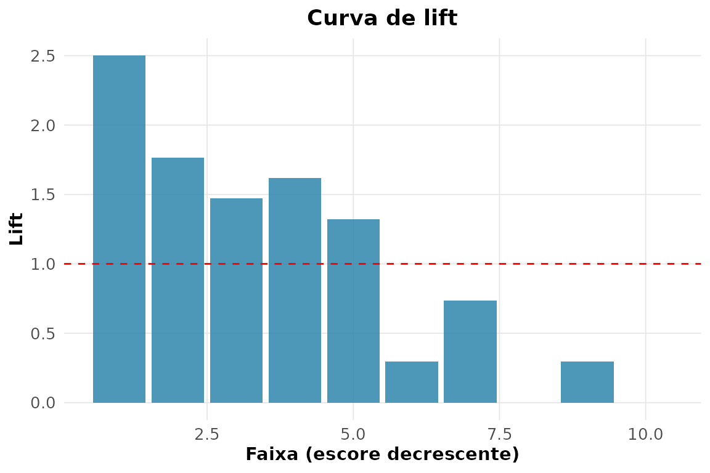

``` r

rnp_curva_ganho(obs_bin, prob_pima, positivo = 1)$grafico
```

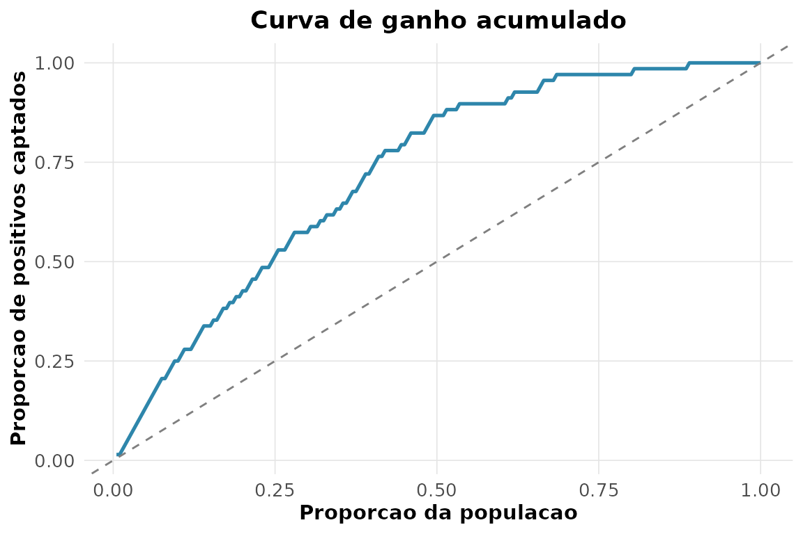

**8. Teste de DeLong: modelo completo vs só `glu`.**

``` r

prob_glu <- predict(glm(type ~ glu, Pima.tr, family = binomial()),
                    type = "response")
rnp_comparar_roc(obs_bin, prob_pima, prob_glu, positivo = 1)
#> # A tibble: 1 × 5
#>    auc1  auc2 diferenca     z p_valor
#>   <dbl> <dbl>     <dbl> <dbl>   <dbl>
#> 1 0.836 0.789    0.0465  2.28  0.0226
```

**9. Sensibilidade, especificidade e razões de verossimilhança.**

``` r

rnp_acuracia_diagnostica(obs_bin, pred_bin, positivo = 1)
#> # A tibble: 8 × 2
#>   metrica          valor
#>   <chr>            <dbl>
#> 1 sensibilidade    0.574
#> 2 especificidade   0.856
#> 3 vpp              0.672
#> 4 vpn              0.796
#> 5 razao_veross_pos 3.98 
#> 6 razao_veross_neg 0.498
#> 7 acuracia         0.76 
#> 8 prevalencia      0.34
```

**10. Métricas de regressão (`medv ~ rm + lstat`).**

``` r

rnp_metricas_regressao(Boston$medv, predict(lm(medv ~ rm + lstat, Boston)))
#> # A tibble: 5 × 2
#>   metrica        valor
#>   <chr>          <dbl>
#> 1 rmse           5.52 
#> 2 mae            3.95 
#> 3 mape          20.8  
#> 4 r2             0.639
#> 5 rmse_relativo  0.245
```

**11. Modelo simples vs múltiplo.**

``` r

simples  <- rnp_metricas_regressao(Boston$medv, predict(lm(medv ~ rm, Boston)))
multiplo <- rnp_metricas_regressao(Boston$medv,
                                   predict(lm(medv ~ rm + lstat + crim, Boston)))
merge(simples, multiplo, by = "metrica", suffixes = c("_simples", "_multiplo"))
#>         metrica valor_simples valor_multiplo
#> 1           mae        4.4478         3.8913
#> 2          mape       25.7673        20.0143
#> 3            r2        0.4835         0.6459
#> 4          rmse        6.6031         5.4678
#> 5 rmse_relativo        0.2930         0.2427
```

**12. Impacto de um outlier: RMSE vs MAE.**

``` r

obs_out <- Boston$medv; obs_out[1] <- 500
pred    <- predict(lm(medv ~ rm + lstat, Boston))
rnp_metricas_regressao(obs_out, pred)[
  rnp_metricas_regressao(obs_out, pred)$metrica %in% c("rmse", "mae"), ]
#> # A tibble: 2 × 2
#>   metrica valor
#>   <chr>   <dbl>
#> 1 rmse    21.7 
#> 2 mae      4.87
```

O RMSE dispara com o outlier, enquanto o MAE — por não elevar o erro ao
quadrado — é bem menos afetado.

**13. Matriz de custo (falso negativo custa o triplo do falso
positivo).**

O pacote não traz uma função dedicada; a matriz de confusão e os pesos
resolvem o problema diretamente:

``` r

cm <- rnp_matriz_confusao(obs_bin, pred_bin)$matriz
fn <- cm[1, 2]; fp <- cm[2, 1]            # falsos negativos e positivos
custo_total <- 3 * fn + 1 * fp
c(falsos_negativos = fn, falsos_positivos = fp, custo_total = custo_total)
#> falsos_negativos falsos_positivos      custo_total 
#>               19               29               86
```

Atribuindo peso 3 ao falso negativo, o custo total penaliza mais os
diabéticos não detectados — coerente com a gravidade clínica desse erro.

## Referências

Montgomery, Douglas C., and George C. Runger. 2021. *Estatística
Aplicada e Probabilidade Para Engenheiros*. 7th ed. LTC.
