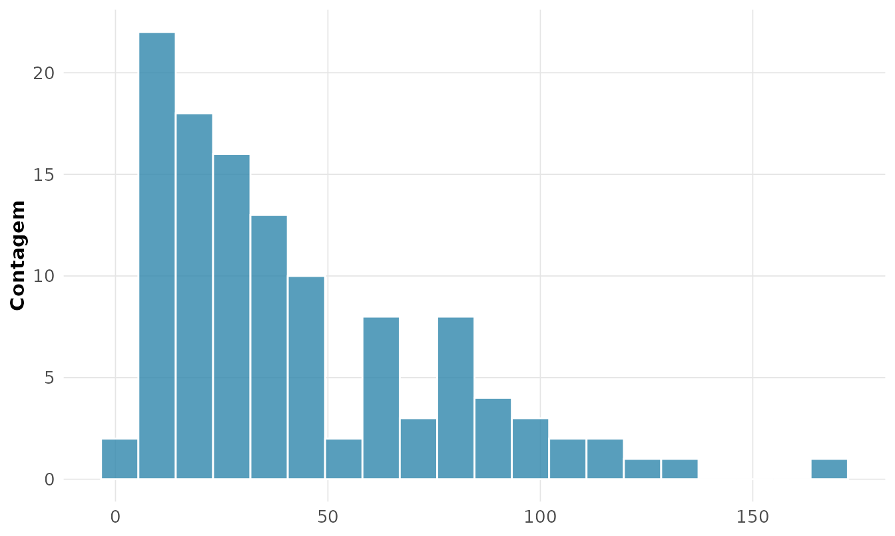
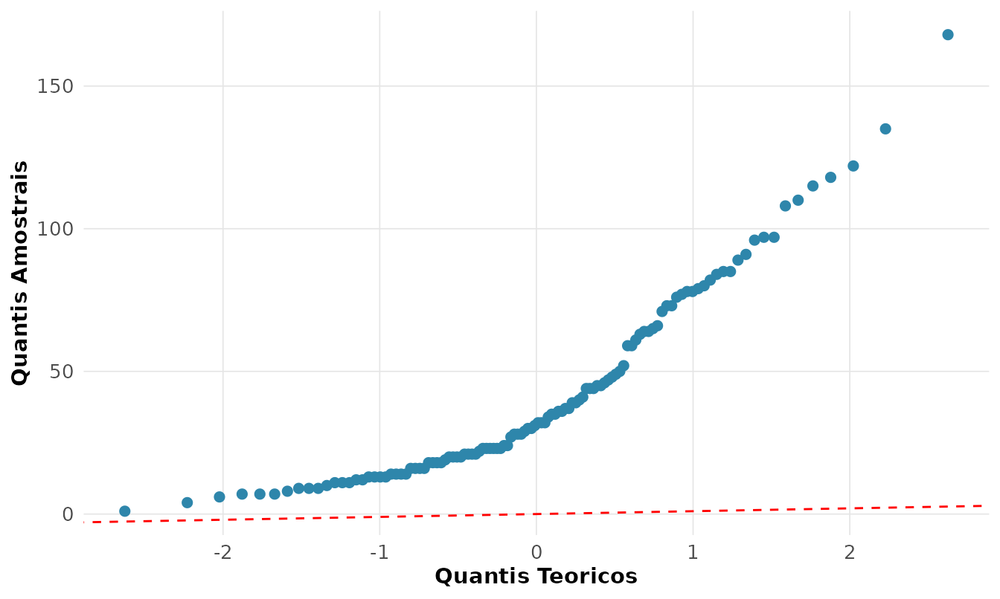

# 1. Estatistica Descritiva e Analise Exploratoria

## Antes de qualquer modelo, *olhe* os dados

John Tukey, que cunhou o termo *Analise Exploratoria de Dados* (EDA),
dizia que “o maior valor de um grafico e quando ele nos forca a notar o
que jamais esperavamos ver”. A estatistica descritiva nao e um preludio
menor da inferencia: e onde se aprende a **enxergar** a forma, o centro,
a dispersao e as anomalias de uma variavel antes de assumir qualquer
modelo.

Usaremos o conjunto `airquality` — medicoes diarias reais de qualidade
do ar em Nova York no verao de 1973 (radiacao solar, vento, temperatura
e ozonio).

``` r

dados <- airquality
rnp_estrutura(dados)
#> # A tibble: 6 × 5
#>   variavel classe      n n_faltantes p_faltantes
#>   <chr>    <chr>   <int>       <int>       <dbl>
#> 1 Ozone    integer   153          37      0.242 
#> 2 Solar.R  integer   153           7      0.0458
#> 3 Wind     numeric   153           0      0     
#> 4 Temp     integer   153           0      0     
#> 5 Month    integer   153           0      0     
#> 6 Day      integer   153           0      0
```

Repare que `Ozone` e `Solar.R` tem valores faltantes. A coluna
`p_faltantes` quantifica o problema — algo que **toda** analise honesta
reporta antes de prosseguir.

## Medidas de tendencia central: qual “centro”?

``` r

rnp_descritiva(dados$Ozone)
#> # A tibble: 1 × 21
#>       n n_validos n_faltantes  soma media mediana  moda desvio variancia   min
#>   <dbl>     <dbl>       <dbl> <dbl> <dbl>   <dbl> <dbl>  <dbl>     <dbl> <dbl>
#> 1   153       116          37  4887  42.1    31.5    23   33.0     1088.     1
#> # ℹ 11 more variables: q1 <dbl>, q3 <dbl>, max <dbl>, amplitude <dbl>,
#> #   iqr <dbl>, cv <dbl>, se_media <dbl>, ic_inf <dbl>, ic_sup <dbl>,
#> #   assimetria <dbl>, curtose <dbl>
```

A funcao
[`rnp_descritiva()`](https://evandeilton.github.io/rnp/reference/rnp_descritiva.md)
entrega o panorama completo numa linha. O ponto pedagogico central esta
na comparacao **media (42.1) versus mediana (31.5)**: a media e maior
que a mediana. Isso e a assinatura de uma distribuicao **assimetrica a
direita** — poucos dias de ozonio muito alto puxam a media para cima,
enquanto a mediana, sendo um quantil, resiste a esses extremos.

Na pratica:

- **Distribuicao simetrica** -\> media e mediana coincidem; use a media.
- **Distribuicao assimetrica ou com outliers** -\> a mediana descreve
  melhor o “tipico”. E por isso que se reporta a **renda mediana**,
  nunca a media.

### As tres medias e quando cada uma faz sentido

Nem toda media e a aritmetica. O pacote calcula as quatro classicas:

``` r

rnp_medias(c(2, 8, 32))
#> # A tibble: 4 × 2
#>   tipo       valor
#>   <chr>      <dbl>
#> 1 aritmetica 14   
#> 2 geometrica  8   
#> 3 harmonica   4.57
#> 4 quadratica 19.1
```

- **Aritmetica**: para grandezas que se somam (alturas, notas).
- **Geometrica**: para **taxas de crescimento** e fatores
  multiplicativos (um investimento que rende +100% e depois -50% tem
  media geometrica 0%, nao 25%).
- **Harmonica**: para **razoes** como velocidade media de um percurso
  (km/h) ou P/L de uma carteira.

A desigualdade
$`\text{harmonica} \le \text{geometrica} \le \text{aritmetica}`$ vale
sempre para valores positivos — verifique acima.

## Dispersao: o centro nao conta a historia toda

Duas turmas podem ter a mesma media 6,0 e realidades opostas: uma com
todos proximos de 6, outra polarizada entre 2 e 10. A **dispersao** mede
isso.

``` r

rnp_descritiva(dados$Wind)[c("desvio", "iqr", "cv")]
#> # A tibble: 1 × 3
#>   desvio   iqr    cv
#>    <dbl> <dbl> <dbl>
#> 1   3.52   4.1 0.354
```

- **Desvio-padrao**: dispersao na mesma unidade da variavel.
- **IQR** (amplitude interquartilica): dispersao *robusta*, imune a
  outliers.
- **Coeficiente de variacao (CV = DP/media)**: dispersao **relativa**,
  adimensional. So tem sentido para variaveis de razao com media
  positiva (nunca para temperatura em Celsius!). Permite comparar a
  variabilidade de grandezas em escalas diferentes.

## Momentos: a forma da distribuicao

Media e variancia sao o 1o e o 2o momentos. O 3o e o 4o descrevem a
**forma**:

``` r

m <- rnp_momentos(dados$Temp)
m$resumo
#> # A tibble: 1 × 6
#>   media variancia desvio_padrao assimetria curtose_excesso     n
#>   <dbl>     <dbl>         <dbl>      <dbl>           <dbl> <dbl>
#> 1  77.9      89.6          9.47     -0.374          -0.429   153
```

- **Assimetria (skewness)**: mede o desequilibrio das caudas. Positiva =
  cauda longa a direita; negativa = a esquerda; ~0 = simetrica.
- **Curtose em excesso**: compara o peso das caudas com a Normal (cuja
  curtose em excesso e 0). Positiva (leptocurtica) = caudas pesadas,
  mais outliers do que a Normal preveria. **Cuidado com o mito**:
  curtose mede peso de cauda, nao “quao pontuda” e a distribuicao.

## Tabelas de frequencia

Para variaveis discretas ou agrupadas, a tabela de frequencias organiza
a informacao. Para o mes (categorica):

``` r

rnp_tabela_frequencia(dados$Month)
#> # A tibble: 5 × 5
#>   categoria    fa    fr fa_acumulada fr_acumulada
#>   <chr>     <int> <dbl>        <int>        <dbl>
#> 1 5            31 0.203           31        0.203
#> 2 6            30 0.196           61        0.399
#> 3 7            31 0.203           92        0.601
#> 4 8            31 0.203          123        0.804
#> 5 9            30 0.196          153        1
```

Para uma continua, agrupamos em classes (a regra de Sturges escolhe o
numero de classes automaticamente):

``` r

head(rnp_tabela_classes(dados$Temp, regra = "sturges"), 4)
#> # A tibble: 4 × 8
#>   classe      lim_inf lim_sup ponto_medio    fa     fr fa_acumulada fr_acumulada
#>   <chr>         <dbl>   <dbl>       <dbl> <int>  <dbl>        <int>        <dbl>
#> 1 [56,60.6]      56      60.6        58.3     8 0.0523            8       0.0523
#> 2 (60.6,65.1]    60.6    65.1        62.8    10 0.0654           18       0.118 
#> 3 (65.1,69.7]    65.1    69.7        67.4    14 0.0915           32       0.209 
#> 4 (69.7,74.2]    69.7    74.2        71.9    16 0.105            48       0.314
```

## Deteccao de outliers: dois criterios, duas filosofias

``` r

rnp_outliers(dados$Ozone, method = "iqr")
#> # A tibble: 2 × 2
#>   indice valor
#>    <int> <int>
#> 1     62   135
#> 2    117   168
```

- **Criterio de Tukey (IQR)**: marca como outlier o que cai fora de
  $`[Q_1 - 1{,}5\,\text{IQR},\; Q_3 + 1{,}5\,\text{IQR}]`$. **Robusto**
  — usa quantis, nao se deixa contaminar pelos proprios extremos.
- **Criterio z-score**: marca o que esta a mais de $`k`$ desvios da
  media. **Fragil** em distribuicoes assimetricas, porque media e DP ja
  foram inflados pelos outliers que se quer detectar.

Para `Ozone`, assimetrica, o criterio IQR e o mais defensavel.

## A EDA grafica

Numeros resumem; graficos revelam. O histograma mostra a forma:

``` r

rnp_grafico_histograma(dados, "Ozone", bins = 20)
```



A assimetria a direita que diagnosticamos pelos numeros agora salta aos
olhos. O **boxplot** comprime os cinco numeros de Tukey e expoe outliers
por grupo:

``` r

rnp_grafico_boxplot(dados, x = "Month", y = "Ozone")
```


O **grafico Q-Q** confronta os dados com a Normal teorica — pontos fora
da reta denunciam o afastamento da normalidade:

``` r

rnp_grafico_qq(dados$Ozone)
```



A curvatura sistematica confirma: `Ozone` **nao** e normal. Esse
diagnostico visual e o que justifica, mais adiante, transformar a
variavel ou usar metodos robustos.

## Sintese

| Pergunta               | Ferramenta `rnp`                            |
|------------------------|---------------------------------------------|
| Qual o centro tipico?  | `rnp_descritiva` (media vs mediana)         |
| Quanto varia?          | desvio, IQR, CV                             |
| Qual a forma?          | `rnp_momentos` (assimetria, curtose)        |
| Ha anomalias?          | `rnp_outliers`                              |
| Como e a distribuicao? | `rnp_grafico_histograma`, `_boxplot`, `_qq` |

O proximo passo natural — entender *por que* a media amostral se
comporta como se comporta — nos leva a **probabilidade** (vinheta 2).
