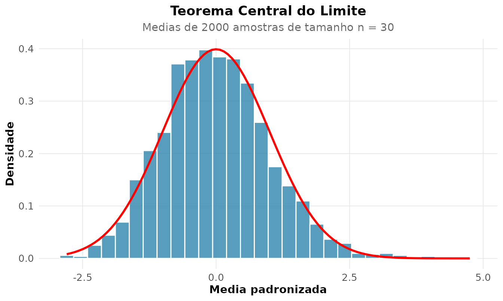

# 2. Probabilidade, Distribuicoes e os Teoremas Fundamentais

## A ponte entre o acaso e os dados

Probabilidade e a linguagem que descreve a incerteza *antes* de observar
os dados; a estatistica inverte a seta, indo dos dados as causas. Esta
vinheta trata dos conceitos centrais dessa transicao: as
**distribuicoes**, o **Teorema de Bayes**, a **Lei dos Grandes Numeros**
e o **Teorema Central do Limite**.

## Distribuicoes de probabilidade

Uma variavel aleatoria e descrita por sua distribuicao. O `rnp` oferece
uma familia consistente de funcoes `rnp_distribuicao_*`, todas com os
quatro verbos classicos: `d` (densidade/massa), `p` (acumulada), `q`
(quantil), `r` (amostra).

``` r

# P(Z <= 1.96) para a Normal padrao
rnp_distribuicao_normal("p", q = 1.96)
#> [1] 0.9750021
```

Visualizar a forma e meio caminho para entende-la:

``` r

rnp_grafico_distribuicao("norm", mean = 0, sd = 1)
```


Cada distribuicao modela um mecanismo gerador:

| Distribuicao | Modela | Exemplo |
|----|----|----|
| Binomial | nº de sucessos em $`n`$ ensaios | acertos em prova de multipla escolha |
| Poisson | contagens em intervalo fixo | chamadas por hora num call center |
| Normal | soma de muitos efeitos pequenos | erro de medicao |
| Exponencial | tempo ate o proximo evento | tempo entre falhas |

A esperanca e a variancia teoricas saem direto dos parametros:

``` r

rnp_esperanca_var("binom", size = 10, prob = 0.3)
#> # A tibble: 1 × 4
#>   distribuicao esperanca variancia desvio
#>   <chr>            <dbl>     <dbl>  <dbl>
#> 1 binom                3       2.1   1.45
```

## Teorema de Bayes: a falacia da taxa-base

Poucos resultados sao tao contraintuitivos — e tao importantes — quanto
Bayes. Considere um teste para uma doenca rara:

- Prevalencia: **1%** da populacao tem a doenca.
- Sensibilidade: o teste acerta **99%** dos doentes.
- Especificidade: **95%** (logo, 5% de falsos positivos).

Pergunta: **uma pessoa testou positivo. Qual a probabilidade de estar
doente?** A intuicao grita “99%”. A conta diz outra coisa:

``` r

rnp_bayes(
  priori          = c(doente = 0.01, sadio = 0.99),
  verossimilhanca = c(0.99, 0.05)   # P(+ | doente), P(+ | sadio)
)
#> # A tibble: 2 × 5
#>   hipotese priori verossimilhanca conjunta posteriori
#>   <chr>     <dbl>           <dbl>    <dbl>      <dbl>
#> 1 doente     0.01            0.99   0.0099      0.167
#> 2 sadio      0.99            0.05   0.0495      0.833
```

A probabilidade *a posteriori* de estar doente e de apenas **~17%**! O
motivo: os sadios sao tao numerosos (99%) que seus 5% de falsos
positivos *inundam* os verdadeiros positivos. Ignorar a prevalencia (a
“taxa-base”) e um erro classico — de medicos a juris. Bayes nos obriga a
combinar a evidencia (o teste) com o que ja sabiamos (a priori).

## Lei dos Grandes Numeros: por que a media estabiliza

A LGN garante que a **media amostral converge para a media
populacional** a medida que $`n`$ cresce. Nao e fe — e teorema. Vamos
*ver* isso para o lancamento de um dado honesto (media teorica 3,5):

``` r

rnp_lei_grandes_numeros(function(n) sample(1:6, n, TRUE), media_teorica = 3.5)
```


A media acumulada oscila muito no inicio e vai se “colando” a linha
vermelha. **E por isso que cassinos lucram e pesquisas eleitorais
funcionam**: no agregado, o acaso individual se cancela.

## Teorema Central do Limite

Se a LGN diz *para onde* a media vai, o TCL diz **como** ela chega la: a
distribuicao da media amostral padronizada tende a uma **Normal**,
*qualquer que seja a distribuicao de origem* (com variancia finita). E
essa propriedade que explica a presenca da Normal em tantos contextos e
que sustenta boa parte da inferencia (intervalos de confianca, testes t
e z) mesmo quando os dados brutos nao sao normais.

Vamos partir de uma distribuicao deliberadamente **assimetrica**
(exponencial) e observar a media de amostras de tamanho 30:

``` r

rnp_tcl_simulacao(function(n) rexp(n), n = 30, n_amostras = 2000)
```



O histograma das medias — partindo de algo nada normal — adere a curva
Normal sobreposta. E esse resultado que autoriza tratar a media amostral
como aproximadamente Normal, base de praticamente todos os intervalos de
confianca da vinheta 3.

## Simulacao de Monte Carlo

Quando a conta analitica e dificil, simula-se. Para estimar
$`\int_0^1 x^2\,dx = 1/3`$:

``` r

rnp_monte_carlo(function(x) x^2, limites = c(0, 1), n = 1e5)
#> # A tibble: 1 × 5
#>   estimativa erro_padrao ic_inf ic_sup      n
#>        <dbl>       <dbl>  <dbl>  <dbl>  <dbl>
#> 1      0.334      0.0009  0.333  0.336 100000
```

A estimativa cerca o valor verdadeiro (1/3) e ainda fornece um
**erro-padrao** e um IC — Monte Carlo nao da apenas um numero, da uma
medida da sua propria incerteza.

## Ajustando uma distribuicao a dados reais

O conjunto `faithful` traz tempos reais de erupcao do geiser Old
Faithful. Sera que os *intervalos de espera* seguem alguma distribuicao
conhecida? Ajustamos por maxima verossimilhanca e medimos a qualidade:

``` r

rnp_ajuste_distribuicao(faithful$waiting, dist = "norm")$qualidade
#> # A tibble: 1 × 5
#>   log_veross   aic   bic ks_estatistica     n
#>        <dbl> <dbl> <dbl>          <dbl> <int>
#> 1     -1095. 2195. 2202.          0.152   272
```

A estatistica de Kolmogorov-Smirnov e o AIC quantificam o ajuste.
(Spoiler: a espera do Old Faithful e na verdade **bimodal** — um unico
ajuste Normal nao captura isso, o que se ve num histograma. Bom lembrete
de que ajustar e sempre *confrontar* o modelo com os dados, nunca
confiar cegamente num numero.)

## Sintese

- **Distribuicoes** sao modelos de mecanismos geradores; conheca o
  mecanismo antes de escolher a distribuicao.
- **Bayes** combina evidencia e conhecimento previo; ignorar a taxa-base
  engana.
- **LGN** garante que medias estabilizam; **TCL** garante que elas viram
  Normais — a fundacao de toda a inferencia que vem a seguir.
