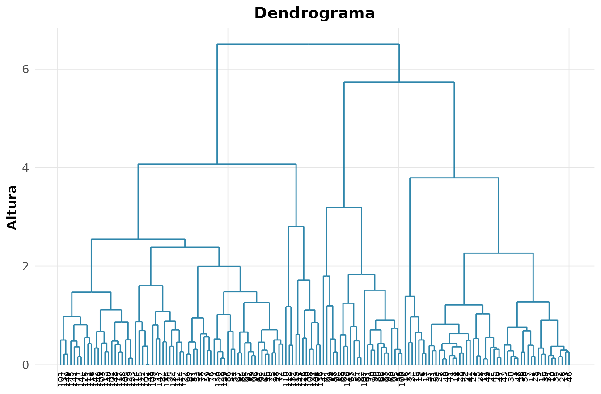

# 5. Analise Multivariada

## Quando as variaveis nao vivem sozinhas

Ate aqui olhamos uma ou duas variaveis por vez. O mundo real e
**multidimensional**: um floricultor mede quatro dimensoes de cada flor,
um banco dezenas de indicadores por cliente. A analise multivariada
estuda a *estrutura conjunta* — correlacoes, agrupamentos e direcoes de
maior variacao. E o ponto em que a **algebra linear** cobra a fatura:
autovalores, autovetores e projecoes deixam de ser abstracoes e viram
ferramentas.

Usaremos o classico `iris` — medidas reais de 150 flores de tres
especies, coletadas por Edgar Anderson e imortalizadas por Fisher em
1936.

``` r

X <- iris[, 1:4]
mc <- rnp_matriz_correlacao(X)
mc$matriz
#>              Sepal.Length Sepal.Width Petal.Length Petal.Width
#> Sepal.Length       1.0000     -0.1176       0.8718      0.8179
#> Sepal.Width       -0.1176      1.0000      -0.4284     -0.3661
#> Petal.Length       0.8718     -0.4284       1.0000      0.9629
#> Petal.Width        0.8179     -0.3661       0.9629      1.0000
```

``` r

rnp_grafico_correlograma(X)
```


Petalas (comprimento e largura) sao fortemente correlacionadas —
carregam informacao redundante. Essa redundancia e justamente o que a
PCA explora.

## PCA: a decomposicao espectral da covariancia

A **Analise de Componentes Principais** encontra novas direcoes
(combinacoes lineares das variaveis originais) que (i) sao ortogonais
entre si e (ii) capturam o maximo de variancia possivel.
Matematicamente, **os componentes sao os autovetores da matriz de
covariancia, e os autovalores sao as variancias ao longo deles**. PCA
*e* decomposicao espectral — nada mais.

``` r

pca <- rnp_pca(X)
pca$variancia
#> # A tibble: 4 × 4
#>   componente variancia percentual acumulada
#>   <chr>          <dbl>      <dbl>     <dbl>
#> 1 PC1           2.92       0.730      0.730
#> 2 PC2           0.914      0.228      0.958
#> 3 PC3           0.147      0.0367     0.995
#> 4 PC4           0.0207     0.0052     1
```

A coluna `acumulada` e a chave: os dois primeiros componentes ja
explicam ~96% da variacao das quatro medidas. Reduzimos de 4 para 2
dimensoes perdendo quase nada — a essencia da reducao de
dimensionalidade.

O **biplot** sobrepoe as observacoes (pontos) e as variaveis (vetores)
no mesmo plano:

``` r

rnp_biplot(pca)
```


Vetores que apontam na mesma direcao sao correlacionados; o comprimento
indica quanto a variavel pesa nos componentes. Veja como as petalas
dominam o primeiro componente.

## Agrupamento: encontrando estrutura sem rotulos

E se nao soubessemos as especies? O **cluster** busca grupos naturais. O
**k-means** particiona minimizando a variancia intragrupo:

``` r

km <- rnp_kmeans(X, k = 3)
km$metricas
#> # A tibble: 1 × 5
#>   wss_total between_ss ratio_ss     k  nobs
#>       <dbl>      <dbl>    <dbl> <dbl> <int>
#> 1      139.       457.    0.767     3   150
```

Mas k-means assume grupos esfericos e e sensivel a outliers. O
**k-medoids** (PAM) usa observacoes reais como centros — mais robusto. E
o **cluster hierarquico** nao exige fixar $`k`$ de antemao, construindo
uma arvore de fusoes:

``` r

ch <- rnp_cluster_hierarquico(X, k = 3)
rnp_grafico_dendrograma(ch)
```



A altura de cada fusao no dendrograma indica a dissimilaridade — cortes
baixos unem o que e parecido.

### Quantos grupos? A silhueta decide

Escolher $`k`$ e a pergunta mais delicada do clustering. A **silhueta**
mede, para cada ponto, quao bem ele pertence ao seu grupo versus ao
vizinho mais proximo (varia de -1 a 1):

``` r

sil <- rnp_silhueta(X, km$clusters$cluster)
sil$media
#> [1] 0.5062
```

Silhueta media alta (proxima de 1) indica grupos coesos e bem separados.
E um criterio *interno* — nao precisa dos rotulos verdadeiros — para
validar o numero de clusters.

## Classificacao supervisionada: LDA

Quando os rotulos sao conhecidos, a **Analise Discriminante Linear**
busca as combinacoes lineares que *maximizam a separacao entre classes*
relativa a variacao dentro delas (a razao de Fisher). E prima da PCA,
mas com um objetivo diferente: PCA maximiza variancia total, LDA
maximiza separabilidade.

``` r

lda <- rnp_lda(Species ~ ., iris)
lda$acuracia
#> [1] 0.98
```

Com apenas duas funcoes discriminantes, a LDA separa as tres especies
com alta acuracia — Fisher escolheu bem seu exemplo.

## Testes multivariados de medias

O teste t compara a media de *uma* variavel. E quando queremos comparar
o **vetor de medias** de varias variaveis ao mesmo tempo? O **T2 de
Hotelling** e a generalizacao multivariada do teste t para duas
amostras:

``` r

rnp_hotelling(iris[1:50, 1:4], iris[51:100, 1:4])
#> # A tibble: 1 × 5
#>      t2 estatistica_f   gl1   gl2 p_valor
#>   <dbl>         <dbl> <int> <dbl>   <dbl>
#> 1 2581.          625.     4    95       0
```

Para mais de dois grupos, a **MANOVA** estende a ANOVA, testando se os
vetores de media diferem entre as especies (estatisticas de Wilks e
Pillai):

``` r

rnp_manova(cbind(Sepal.Length, Petal.Length) ~ Species, iris)
#> # A tibble: 2 × 4
#>   teste  estatistica aprox_f p_valor
#>   <chr>        <dbl>   <dbl>   <dbl>
#> 1 Wilks       0.0399   293.        0
#> 2 Pillai      0.988     71.8       0
```

Fazer um teste multivariado em vez de varios testes univariados
**controla o erro tipo I global** e captura correlacoes entre as
respostas — duas vantagens que o “teste a teste” perde.

## Sintese

| Objetivo | Metodo | Ideia central |
|----|----|----|
| Reduzir dimensao | `rnp_pca` + `rnp_biplot` | autovetores da covariancia |
| Achar grupos | `rnp_kmeans`, `rnp_cluster_hierarquico` | minimizar dissimilaridade interna |
| Validar grupos | `rnp_silhueta` | coesao vs separacao |
| Classificar (com rotulo) | `rnp_lda` | razao de Fisher |
| Comparar vetores de media | `rnp_hotelling`, `rnp_manova` | generalizam t e ANOVA |

Muitos desses metodos repousam sobre a mesma base de algebra linear —
autovalores, autovetores e projecoes —, o que ajuda a ver as semelhancas
entre eles.
