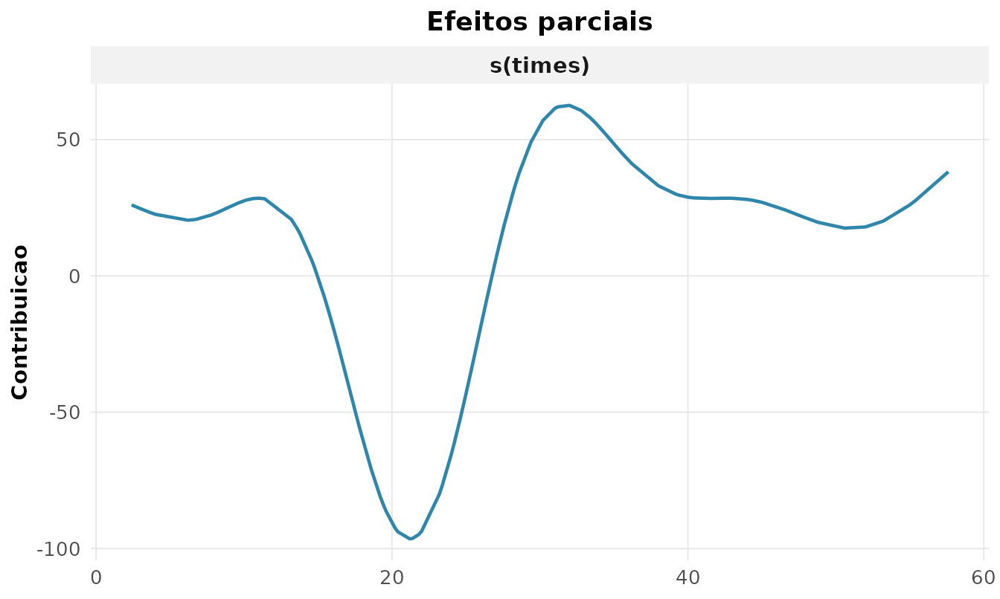

# 9. Modelos lineares generalizados e extensões

A regressão linear pressupõe resposta contínua e normal. Muitas
variáveis não são assim: contagens, proporções, respostas ordinais. Os
**modelos lineares generalizados** (GLM) estendem a regressão a
respostas da família exponencial, ligando a média ao preditor linear por
uma função de ligação $`g`$(McCullagh and Nelder 1989; Paula 2013):

``` math
g(\mu) = \eta = \beta_0 + \beta_1 x_1 + \dots + \beta_p x_p, \qquad \mu = E[Y].
```

## GLM para contagens (Poisson)

Para contagens, usa-se a família Poisson com ligação log, de modo que
$`e^{\beta_j}`$ é a **razão de taxas** (IRR). Modelando o número de
rupturas de fios em teares:

``` r

g <- rnp_glm(breaks ~ wool + tension, data = warpbreaks, familia = "poisson")
g$coeficientes
#> # A tibble: 4 × 7
#>   termo       estimativa erro_padrao estatistica p_valor ic_inf ic_sup
#>   <chr>            <dbl>       <dbl>       <dbl>   <dbl>  <dbl>  <dbl>
#> 1 (Intercept)      3.69       0.0454       81.3   0       3.60   3.78 
#> 2 woolB           -0.206      0.0516       -3.99  0.0001 -0.307 -0.105
#> 3 tensionM        -0.321      0.0603       -5.33  0      -0.439 -0.203
#> 4 tensionH        -0.518      0.064        -8.11  0      -0.644 -0.393
```

O coeficiente de `tensionH` ($`-0{,}52`$) indica que tensão alta
multiplica a taxa de rupturas por $`e^{-0{,}52} \approx 0{,}59`$
(redução de 41%).

### Verificando a adequação

O modelo Poisson supõe $`\operatorname{Var}(Y) = \mu`$. Quando a
variância excede a média, há **superdispersão**, e os erros-padrão ficam
subestimados. A dispersão é estimada por
$`\hat\phi = \frac{1}{n-p}\sum r_{P,i}^2`$:

``` r

rnp_glm_diagnosticos(g$objeto)$testes
#> # A tibble: 3 × 4
#>   medida                   valor p_valor interpretacao                 
#>   <chr>                    <dbl>   <dbl> <chr>                         
#> 1 dispersao                 4.26      NA superdispersao                
#> 2 deviance/gl               4.21      NA NA                            
#> 3 qui-quadrado de Pearson 213.         0 falta de ajuste/superdispersao
```

A dispersão de **4,3** (muito acima de 1) denuncia forte superdispersão:
o modelo Poisson é inadequado aqui.

## Binomial negativa: corrigindo a superdispersão

A binomial negativa acrescenta um parâmetro $`\theta`$ que acomoda a
variância extra, $`\operatorname{Var}(Y) = \mu + \mu^2/\theta`$. Com os
dados de ausências escolares
[`MASS::quine`](https://rdrr.io/pkg/MASS/man/quine.html):

``` r

nb <- rnp_binomial_negativa(Days ~ Sex + Age, data = MASS::quine)
nb$theta
#> [1] 1.1474
```

O $`\hat\theta = 1.15`$ é pequeno, confirmando a superdispersão; quanto
menor $`\theta`$, maior a variância extra em relação à Poisson. O ganho
de ajuste é enorme: o AIC cai de **2507** (Poisson) para **1120**
(binomial negativa) — a NB é claramente o modelo adequado.

## Resposta ordinal: odds proporcionais

Para respostas em categorias ordenadas (baixa \< média \< alta
satisfação), o modelo de **odds proporcionais** modela as probabilidades
acumuladas:

``` math
\operatorname{logit}\big(P(Y \le j)\big) = \zeta_j - x^\top\beta.
```

``` r

rnp_regressao_ordinal(Sat ~ Infl + Type, data = MASS::housing,
                      pesos = MASS::housing$Freq)$coeficientes
#> # A tibble: 5 × 5
#>   termo         estimativa erro_padrao p_valor odds_ratio
#>   <chr>              <dbl>       <dbl>   <dbl>      <dbl>
#> 1 InflMedium         0.548       0.104  0           1.73 
#> 2 InflHigh           1.24        0.126  0           3.45 
#> 3 TypeApartment     -0.522       0.118  0           0.594
#> 4 TypeAtrium        -0.289       0.153  0.0592      0.749
#> 5 TypeTerrace       -1.01        0.150  0           0.363
```

A razão de chances de `InflHigh` é $`3{,}4`$: morar onde se percebe alta
influência sobre a gestão multiplica por 3,4 a chance de estar em uma
categoria de satisfação superior.

## Modelos mistos: dados agrupados

Quando há medidas repetidas ou agrupamento (alunos em escolas, medidas
em indivíduos), as observações não são independentes. O **modelo misto**
separa a variação em efeitos fixos e aleatórios:
$`y_{ij} = x_{ij}^\top\beta + b_i + \varepsilon_{ij}`$. Usando o
crescimento dental
[`nlme::Orthodont`](https://rdrr.io/pkg/nlme/man/Orthodont.html):

``` r

mm <- rnp_modelo_misto(distance ~ age, data = nlme::Orthodont,
                       aleatorio = ~ 1 | Subject)
mm$variancia
#> # A tibble: 3 × 2
#>   componente variancia
#>   <chr>          <dbl>
#> 1 aleatorio      4.47 
#> 2 residuo        2.05 
#> 3 ICC            0.686
```

A **correlação intraclasse** (ICC) de $`0{,}69`$ indica que 69% da
variância está *entre* indivíduos — ignorar esse agrupamento (ajustando
um modelo comum) subestimaria os erros-padrão.

## Modelos aditivos (GAM): relações não-lineares

Quando o efeito de um preditor não é linear, o **GAM** o substitui por
uma função suave $`f_j`$ estimada dos dados (Wood 2017):

``` math
g(\mu) = \beta_0 + f_1(x_1) + \dots + f_p(x_p).
```

Com os dados clássicos de aceleração em colisão de motocicleta
[`MASS::mcycle`](https://rdrr.io/pkg/MASS/man/mcycle.html):

``` r

gm <- rnp_gam(accel ~ s(times), data = MASS::mcycle)
gm$suaves
#> # A tibble: 1 × 4
#>   termo      edf estatistica p_valor
#>   <chr>    <dbl>       <dbl>   <dbl>
#> 1 s(times)  8.69        53.5       0
```

Os graus de liberdade efetivos (`edf`) de **8,7** revelam uma relação
fortemente não-linear — um polinômio de baixa ordem jamais a capturaria.
O efeito suave:

``` r

rnp_grafico_efeitos(gm)
```



## Síntese

| Situação                 | Função                  | Família/modelo         |
|--------------------------|-------------------------|------------------------|
| Contagens                | `rnp_glm`               | Poisson (log)          |
| Contagens superdispersas | `rnp_binomial_negativa` | binomial negativa      |
| Resposta binária         | `rnp_glm`               | binomial (logit)       |
| Resposta ordinal         | `rnp_regressao_ordinal` | odds proporcionais     |
| Dados agrupados          | `rnp_modelo_misto`      | efeitos mistos         |
| Efeito não-linear        | `rnp_gam`               | aditivo (suavizadores) |

O diagnóstico é central: foi a dispersão estimada que revelou a
inadequação do Poisson e motivou a binomial negativa.

## Exercícios

Resolva com o `rnp`, usando `warpbreaks`,
[`MASS::quine`](https://rdrr.io/pkg/MASS/man/quine.html),
[`MASS::housing`](https://rdrr.io/pkg/MASS/man/housing.html),
[`nlme::Orthodont`](https://rdrr.io/pkg/nlme/man/Orthodont.html) e
[`MASS::mcycle`](https://rdrr.io/pkg/MASS/man/mcycle.html).

1.  Ajuste um GLM Poisson para `breaks ~ wool + tension` (`rnp_glm`) e
    interprete as razões de taxas.
2.  Avalie a dispersão e teste a superdispersão
    (`rnp_glm_diagnosticos`).
3.  Ajuste uma binomial negativa a `Days ~ Sex + Age` em `quine` e
    compare o AIC com o Poisson (`rnp_binomial_negativa`).
4.  Ajuste um GLM binomial (`am ~ wt + hp`, `mtcars`) e interprete as
    razões de chances (`rnp_glm`, família binomial).
5.  Ajuste um modelo de odds proporcionais à satisfação em `housing`
    (`rnp_regressao_ordinal`).
6.  Ajuste um modelo misto a `distance ~ age` com intercepto aleatório
    por sujeito e calcule o ICC (`rnp_modelo_misto`).
7.  Interprete o ICC: que fração da variância é entre indivíduos?
8.  Ajuste um GAM `accel ~ s(times)` a
    [`MASS::mcycle`](https://rdrr.io/pkg/MASS/man/mcycle.html) e leia os
    graus de liberdade efetivos (`rnp_gam`).
9.  Visualize o efeito suave estimado (`rnp_grafico_efeitos`).
10. Compare a deviance explicada do GAM com a de um ajuste linear
    simples.
11. Ajuste um GLM Gama (ligação log) a uma variável contínua positiva
    (`rnp_glm`, família gamma).
12. Para o modelo Poisson do exercício 1, calcule os resíduos de
    deviance e verifique padrões (`rnp_glm_diagnosticos`).

## Referências

McCullagh, Peter, and John A. Nelder. 1989. *Generalized Linear Models*.
2nd ed. Chapman & Hall.

Paula, Gilberto A. 2013. *Modelos de Regressão Com Apoio Computacional*.
IME-USP.

Wood, Simon N. 2017. *Generalized Additive Models: An Introduction with
r*. 2nd ed. Chapman & Hall/CRC.
