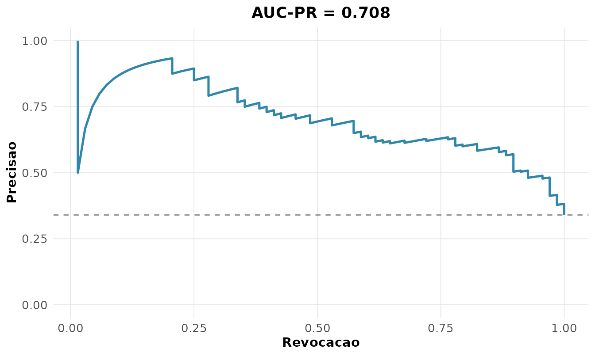

# 11. Avaliação de modelos preditivos

Treinar um modelo é metade do trabalho; a outra é **avaliá-lo** com a
métrica certa. Acurácia sozinha engana em problemas desbalanceados, e um
modelo pode discriminar bem mas estar mal **calibrado** (Kuhn and
Johnson 2013). Esta vinheta percorre as ferramentas de avaliação usando
[`MASS::Pima.tr`](https://rdrr.io/pkg/MASS/man/Pima.tr.html)
(diagnóstico de diabetes), com um modelo completo e um reduzido.

``` r

pima <- MASS::Pima.tr
m_completo <- glm(type ~ glu + bmi + age, pima, family = binomial())
m_reduzido <- glm(type ~ glu, pima, family = binomial())
p1 <- predict(m_completo, type = "response")
p2 <- predict(m_reduzido, type = "response")
pred <- factor(ifelse(p1 > 0.5, "Yes", "No"), levels = c("No", "Yes"))
```

## Métricas de classificação

A partir da matriz de confusão (VP, FP, FN, VN) derivam-se várias
métricas, cada uma respondendo a uma pergunta:

``` math
\text{precisão} = \frac{VP}{VP+FP}, \quad
  \text{revocação} = \frac{VP}{VP+FN}, \quad
  F_1 = \frac{2\,\text{P}\cdot\text{R}}{\text{P}+\text{R}}.
```

``` r

rnp_metricas_classificacao(pima$type, pred, positivo = "Yes")
#> # A tibble: 8 × 2
#>   metrica             valor
#>   <chr>               <dbl>
#> 1 acuracia            0.76 
#> 2 precisao            0.672
#> 3 revocacao           0.574
#> 4 especificidade      0.856
#> 5 f1                  0.619
#> 6 f_beta              0.619
#> 7 mcc                 0.448
#> 8 acuracia_balanceada 0.715
```

A acurácia (0,76) parece boa, mas a **revocação** de 0,57 revela que o
modelo deixa escapar 43% dos diabéticos — crítico em contexto clínico. O
**MCC** (coeficiente de Matthews, 0,45) resume o acerto considerando
todas as células da matriz, robusto ao desbalanceamento.

## Escore de Brier e calibração

O **escore de Brier** mede o erro quadrático das probabilidades,
$`BS = \frac{1}{n}\sum (p_i - y_i)^2`$ — quanto menor, melhor:

``` r

rnp_brier(pima$type, p1, positivo = "Yes")
#> # A tibble: 1 × 3
#>   brier brier_referencia escore_habilidade
#>   <dbl>            <dbl>             <dbl>
#> 1 0.156            0.224             0.305
```

O escore de habilidade (0,30) indica 30% de redução do erro em relação a
prever simplesmente a prevalência. Já a **calibração** verifica se uma
probabilidade predita de 0,7 corresponde a ~70% de eventos observados,
testada por Hosmer-Lemeshow:

``` r

rnp_calibracao(pima$type, p1, positivo = "Yes")$hosmer_lemeshow
#> # A tibble: 1 × 3
#>   estatistica    gl p_valor
#>         <dbl> <int>   <dbl>
#> 1        11.7     8   0.163
```

Com $`p = 0{,}16`$, não se rejeita boa calibração: as probabilidades são
confiáveis.

## Separação: KS e precisão-revocação

A estatística **KS** mede a máxima separação entre as distribuições de
escore das duas classes:

``` r

rnp_ks_classificador(pima$type, p1, positivo = "Yes")$ks
#> [1] 0.5646
```

Um KS de 0,56 indica boa separação. Em dados desbalanceados, a **curva
precisão-revocação** é mais informativa que a ROC; sua área (AUC-PR)
resume o desempenho:

``` r

rnp_curva_precisao_revocacao(pima$type, p1, positivo = "Yes")$grafico
```



## Comparando dois modelos: teste de DeLong

As curvas ROC dos dois modelos podem ser comparadas formalmente. O
**teste de DeLong** avalia se a diferença entre as AUCs é significativa,
levando em conta a correlação por serem avaliadas nos mesmos indivíduos:

``` r

rnp_comparar_roc(pima$type, p1, p2, positivo = "Yes")
#> # A tibble: 1 × 5
#>    auc1  auc2 diferenca     z p_valor
#>   <dbl> <dbl>     <dbl> <dbl>   <dbl>
#> 1 0.836 0.789    0.0465  2.28  0.0226
```

O modelo completo (AUC $`= 0{,}84`$) supera o que usa apenas glicose
(AUC $`= 0{,}79`$), e a diferença é **significativa** ($`p = 0{,}02`$):
incluir IMC e idade melhora a discriminação de forma não atribuível ao
acaso.

## Avaliação de teste diagnóstico

Em contexto clínico, importam as **razões de verossimilhança**, que
independem da prevalência:
$`\text{RV}^+ = \text{sens}/(1-\text{espec})`$ e
$`\text{RV}^- = (1-\text{sens})/\text{espec}`$.

``` r

rnp_acuracia_diagnostica(pima$type, pred, positivo = "Yes")
#> # A tibble: 8 × 2
#>   metrica          valor
#>   <chr>            <dbl>
#> 1 sensibilidade    0.574
#> 2 especificidade   0.856
#> 3 vpp              0.672
#> 4 vpn              0.796
#> 5 razao_veross_pos 3.98 
#> 6 razao_veross_neg 0.498
#> 7 acuracia         0.76 
#> 8 prevalencia      0.34
```

Uma $`\text{RV}^+`$ de 4,0 significa que um resultado positivo é 4 vezes
mais provável em quem tem a doença — multiplicando as chances *a
priori*, conecta-se diretamente ao Teorema de Bayes da vinheta 2.

## E para regressão?

Quando a resposta é contínua, as métricas mudam: o **RMSE** penaliza
erros grandes (mesma unidade da resposta), o **MAE** é mais robusto, o
**MAPE** dá o erro percentual e o **R²** mede a variância explicada:

``` r

fit <- lm(medv ~ rm + lstat, data = MASS::Boston)
rnp_metricas_regressao(MASS::Boston$medv, fitted(fit))
#> # A tibble: 5 × 2
#>   metrica        valor
#>   <chr>          <dbl>
#> 1 rmse           5.52 
#> 2 mae            3.95 
#> 3 mape          20.8  
#> 4 r2             0.639
#> 5 rmse_relativo  0.245
```

O RMSE de 5,5 (mil dólares) e o MAPE de 21% quantificam o erro típico do
modelo de preços. Como em classificação, nenhuma métrica isolada basta —
RMSE e MAE contam histórias diferentes quando há *outliers*.

## Síntese

| Pergunta | Função | Métrica |
|----|----|----|
| Quão certo acerta? | `rnp_metricas_classificacao` | acurácia, F1, MCC |
| Erro de regressão? | `rnp_metricas_regressao` | RMSE, MAE, R² |
| Probabilidades confiáveis? | `rnp_calibracao`, `rnp_brier` | Hosmer-Lemeshow, Brier |
| Quão bem separa? | `rnp_ks_classificador`, `rnp_curva_precisao_revocacao` | KS, AUC-PR |
| Um modelo é melhor? | `rnp_comparar_roc` | DeLong |
| Uso clínico? | `rnp_acuracia_diagnostica` | sens., espec., RV |

Nenhuma métrica isolada conta a história toda: a escolha depende do
custo dos erros e do equilíbrio das classes.

## Exercícios

Resolva com o `rnp`, usando
[`MASS::Pima.tr`](https://rdrr.io/pkg/MASS/man/Pima.tr.html),
[`MASS::Boston`](https://rdrr.io/pkg/MASS/man/Boston.html) e `mtcars`.
Para os classificadores, gere as probabilidades com
`glm(..., family = binomial())`.

1.  Ajuste `type ~ glu + bmi + age` em
    [`MASS::Pima.tr`](https://rdrr.io/pkg/MASS/man/Pima.tr.html) e
    calcule todas as métricas de classificação para o limiar 0,5
    (`rnp_metricas_classificacao`).
2.  Compare o F1 com a acurácia: por que diferem em dados
    desbalanceados?
3.  Calcule o escore de Brier e o escore de habilidade do modelo
    (`rnp_brier`).
4.  Avalie a calibração com o teste de Hosmer-Lemeshow
    (`rnp_calibracao`).
5.  Calcule a estatística KS de separação (`rnp_ks_classificador`).
6.  Construa a curva precisão-revocação e obtenha a AUC-PR
    (`rnp_curva_precisao_revocacao`).
7.  Construa as curvas de lift e de ganho acumulado (`rnp_curva_lift`,
    `rnp_curva_ganho`).
8.  Compare, pelo teste de DeLong, o modelo completo com um que usa só
    `glu` (`rnp_comparar_roc`).
9.  Calcule a sensibilidade, a especificidade e as razões de
    verossimilhança (`rnp_acuracia_diagnostica`).
10. Ajuste `medv ~ rm + lstat` em
    [`MASS::Boston`](https://rdrr.io/pkg/MASS/man/Boston.html) e calcule
    RMSE, MAE, MAPE e R² (`rnp_metricas_regressao`).
11. Compare as métricas de regressão entre um modelo simples e um
    múltiplo.
12. Insira um *outlier* na resposta e observe o impacto sobre RMSE
    versus MAE.
13. Construa a matriz de custo para um classificador em que o falso
    negativo custa o triplo do falso positivo (`rnp_matriz_custo`).

## Referências

Kuhn, Max, and Kjell Johnson. 2013. *Applied Predictive Modeling*.
Springer.
